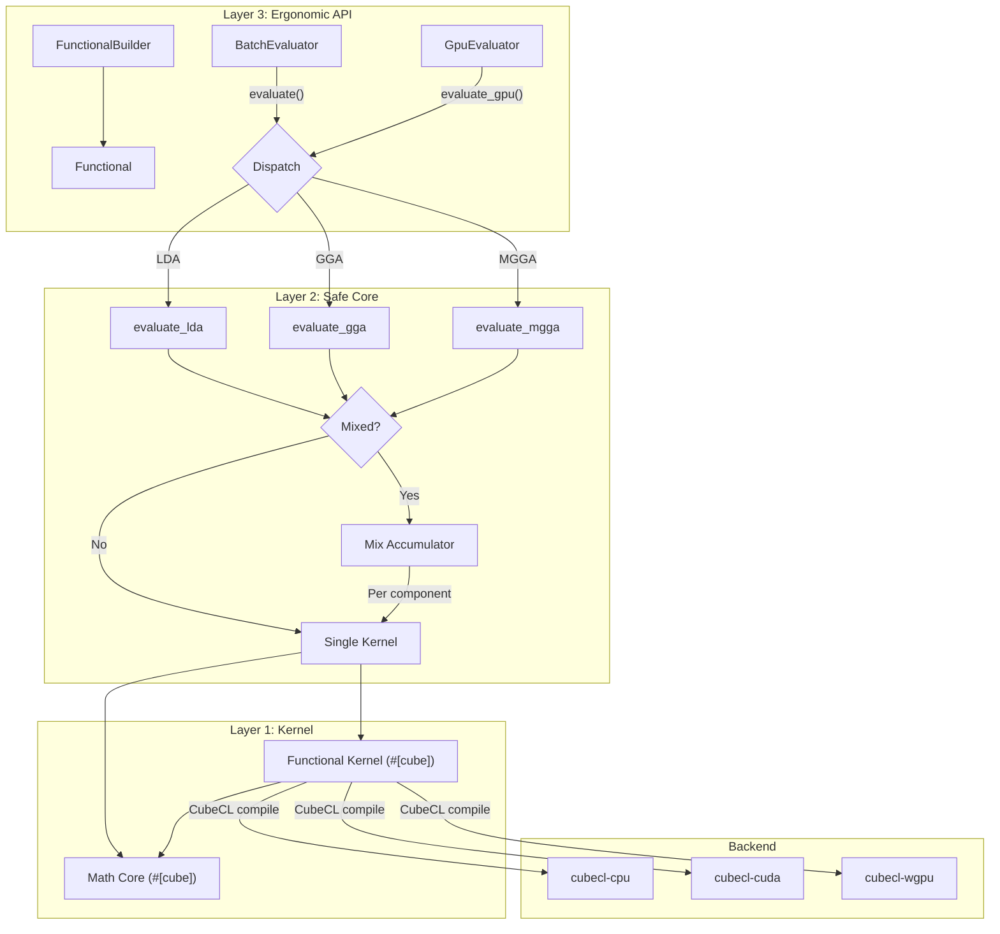
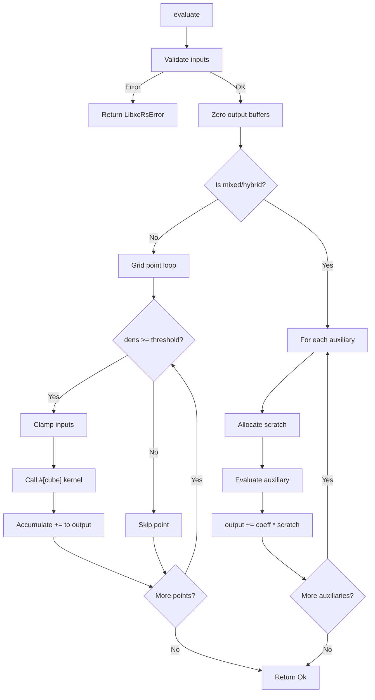
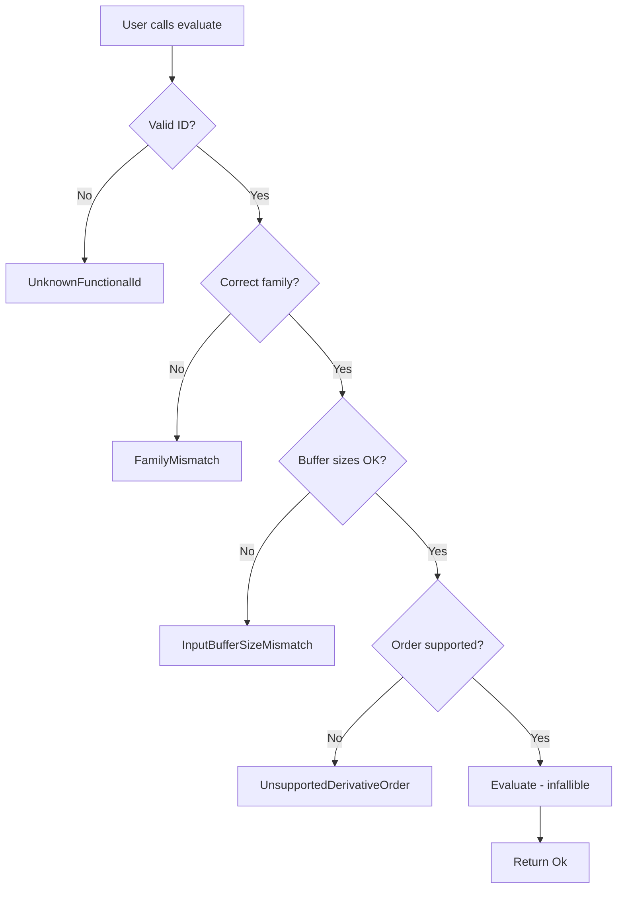

# libxc_rs Detailed Design Document

**Version**: 2.0  
**Date**: 2026-04-07  
**Status**: Implementation-ready  
**Target**: libxc 7.0.0 full public API coverage in pure Rust  

---

## Table of Contents

1. [Executive Summary](#1-executive-summary)
2. [Scope of Investigation and Assumptions](#2-scope-of-investigation-and-assumptions)
3. [Organization of libxc Public APIs](#3-organization-of-libxc-public-apis)
4. [Fundamental Policy for Rust Redesign](#4-fundamental-policy-for-rust-redesign)
5. [API Mapping Table (libxc to Rust)](#5-api-mapping-table-libxc-to-rust)
6. [Domain Model / Data Structure Design](#6-domain-model--data-structure-design)
7. [Mathematical Core Design](#7-mathematical-core-design)
8. [Module Decomposition](#8-module-decomposition)
9. [Responsibilities of Each Module](#9-responsibilities-of-each-module)
10. [Processing Flow](#10-processing-flow)
11. [Flow Diagrams](#11-flow-diagrams)
12. [GPU Design (cubecl)](#12-gpu-design-cubecl)
13. [Memory Design](#13-memory-design)
14. [Performance Design](#14-performance-design)
15. [Error Design (thiserror v2 / anyhow boundary)](#15-error-design-thiserror-v2--anyhow-boundary)
16. [Design for Testability](#16-design-for-testability)
17. [libxc Comparison Verification Plan](#17-libxc-comparison-verification-plan)
18. [Benchmark Plan](#18-benchmark-plan)
19. [List of Libraries Used and Rationale](#19-list-of-libraries-used-and-rationale)
20. [Source Tree](#20-source-tree)
21. [Implementation Phases](#21-implementation-phases)
22. [Risks, Open Issues, and Alternatives](#22-risks-open-issues-and-alternatives)
23. [Acceptance Criteria](#23-acceptance-criteria)
24. [Artifact Location](#24-artifact-location)

---

## 1. Executive Summary

**libxc_rs** is a from-scratch Rust redesign of the libxc 7.0.0 exchange-correlation (XC) functional library used in density functional theory (DFT) calculations. The library covers all 649 functionals across LDA, GGA, MGGA, and hybrid families, with derivatives through 4th order, polarized and unpolarized spin modes, and a unified CubeCL compute substrate that serves both CPU and GPU execution from a single kernel source.

### Key Design Principles

1. **Pure Rust implementation** -- no runtime C/Fortran FFI dependency in the production path
2. **Three-layer API** -- compatibility layer (C API concepts), typed safe core, ergonomic high-level interface
3. **Unified CubeCL substrate** -- single kernel source compiles to CPU (MLIR/LLVM JIT), CUDA, HIP, and WGPU backends
4. **Mathematical core** -- shared numerical building blocks eliminate formula duplication across families and backends
5. **Static registry** -- 649 functional definitions compiled as `'static` tables with zero runtime registration cost
6. **Oracle verification** -- libxc remains the correctness oracle; acceptance requires energy relative error <= 10^-12

### Scope

| Dimension | Coverage |
|-----------|----------|
| Functional IDs | 649 active + 52 removed (legacy alias support) |
| Families | LDA, GGA, MGGA, HYB_LDA, HYB_GGA, HYB_MGGA |
| Derivative orders | 0 (exc), 1 (vxc), 2 (fxc), 3 (kxc), 4 (lxc) |
| Spin modes | Unpolarized (nspin=1), Polarized (nspin=2) |
| Backends | cubecl-cpu (always), cubecl-cuda, cubecl-hip, cubecl-wgpu (feature-gated) |
| Public C functions | 85 functions declared in `xc.h`, all mapped to Rust equivalents |

### What This Document Is Not

This document does not contain the actual Rust formula translations of the 270 maple2c kernel files. Those are implementation artifacts produced manually by a domain expert translating the mathematical expressions. This document specifies the architecture, interfaces, and infrastructure into which those translations plug.

---

## 2. Scope of Investigation and Assumptions

### 2.1 Sources Investigated

| Source | Location | Purpose |
|--------|----------|---------|
| `src/xc.h` | `libxc-master/src/xc.h` | Public API definitions, structs, constants, enums |
| `src/xc_funcs.h` | `libxc-master/src/xc_funcs.h` | 649 functional ID definitions |
| `src/xc_funcs_removed.h` | `libxc-master/src/xc_funcs_removed.h` | 52 removed functional IDs |
| `src/lda.c` | `libxc-master/src/lda.c` | LDA evaluation entry points and dispatch |
| `src/gga.c` | `libxc-master/src/gga.c` | GGA evaluation entry points and dispatch |
| `src/mgga.c` | `libxc-master/src/mgga.c` | MGGA evaluation entry points and dispatch |
| `src/mix_func.c` | `libxc-master/src/mix_func.c` | Hybrid/mixed functional combination logic |
| `src/util.c` | `libxc-master/src/util.c` | Dimension setup, parameter handling, init/end |
| `src/work_lda_inc.c` | `libxc-master/src/work_lda_inc.c` | LDA grid loop template |
| `src/maple2c/` | `libxc-master/src/maple2c/` | 270 auto-generated kernel files (6 dirs) |
| `testsuite/` | `libxc-master/testsuite/` | 10,312 regression tests, 4 test systems |
| CubeCL manual | `docs/manual/Cubecl/` | CubeCL 0.9.0 API, kernel patterns, backend selection |
| `README.md` | `libxc-master/README.md` | Build instructions, overview |

### 2.2 Confirmed Facts (from source investigation)

1. **649 active functional IDs** defined in `xc_funcs.h` (grep-confirmed count)
2. **52 removed functional IDs** in `xc_funcs_removed.h` with aliases to replacement IDs
3. **270 maple2c C kernel files** across 6 directories: `lda_exc/`, `lda_vxc/`, `gga_exc/`, `gga_vxc/`, `mgga_exc/`, `mgga_vxc/`
4. **85 public C functions** declared in `xc.h`: version info (5), reference accessors (4), functional info (10), discovery (8), lifecycle (5), thresholds (4), ext_params (5), LDA evaluation (12), GGA evaluation (12), MGGA evaluation (11), special (2), hybrid (4), auxiliary (3)
5. **Array dimension rules**: LDA unpolarized: all dims=1; polarized: vrho=2, v2rho2=3, v3rho3=4, v4rho4=5. GGA adds sigma dimensions. MGGA adds lapl/tau dimensions with combinatorial explosion (up to 477 components for 4th-order polarized MGGA).
6. **Density thresholding**: grid points with total density < `dens_threshold` are skipped; individual spin densities clamped to `dens_threshold`.
7. **Output accumulation**: maple2c kernels use `+=` on output arrays -- mixed functionals accumulate weighted component contributions.
8. **NULL output pointer convention**: libxc uses NULL pointers to skip derivative levels.
9. **External parameters**: per-functional parameter arrays with names, descriptions, defaults, and a setter callback.
10. **Test infrastructure**: 4 test systems (H, Li, BrOH, BrOH+), bzip2-compressed reference data, relative error metric: `|x-y|/(1+max(|x|,|y|))`.

### 2.3 Assumptions

| # | Assumption | Impact if Wrong | Mitigation |
|---|-----------|-----------------|------------|
| A1 | All 270 maple2c formulas can be faithfully translated to Rust `#[cube]` functions preserving f64 precision | Core project viability | Canary kernel (LDA_X) validates the approach before committing to all 649 |
| A2 | CubeCL 0.9.0 `#[cube]` macro supports all math operations needed (pow, cbrt, exp, log, erf, erfc) | Some functionals may require custom implementations | Build math core with fallback implementations; validate per-functional |
| A3 | CubeCL CPU backend achieves within 1.5x of libxc C for batch evaluation | Performance target may not be met | Benchmark after first 10 functionals; evaluate raw Rust fallback path |
| A4 | f64 is natively supported on cubecl-cpu and cubecl-cuda with full precision | Numerical accuracy could be compromised | Confirmed in cubecl-core source: `impl_float!(f64, F64)` |
| A5 | The 52 removed IDs map to valid replacement IDs | Legacy code using removed IDs would fail | Include alias table; emit deprecation warnings |
| A6 | maple2c formula structure is uniform enough for systematic translation | Some formulas may need special handling | Categorize complexity during Phase 3; track exceptions |
| A7 | The maple2c `my_piecewise3`/`my_piecewise5` pattern maps to CubeCL-compatible branch-free select | GPU divergence may impact performance | Implement as conditional assignment; benchmark impact |

### 2.4 Unresolved Items

| # | Item | Status | Required Resolution |
|---|------|--------|-------------------|
| U1 | CubeCL 0.9.0 `erf`/`erfc` intrinsic availability | Not confirmed in docs | Test with canary kernel; implement in math core if absent |
| U2 | CubeCL `cbrt` (cube root) availability | Used extensively in maple2c (`POW_1_3`) | Implement as `pow(x, 1.0/3.0)` or custom `cbrt` in math core |
| U3 | Maximum kernel size before CubeCL compilation degrades | Some 4th-order MGGA kernels are very large | Benchmark compilation time; consider splitting if needed |
| U4 | WGPU f64 support on specific hardware configurations | Spec says no; some Vulkan adapters may support it | Runtime capability check; typed error on failure |
| U5 | Numerical stability of `pow(x, 1/3)` for negative x in CubeCL | C `cbrt` handles negative values; `pow` may not | Implement `safe_cbrt` in math core with sign handling |
| U6 | Thread safety of CubeCL `ComputeClient` across tokio tasks | Multi-threaded DFT codes may share evaluators | Investigate `Send`/`Sync` bounds; document thread safety |

---

## 3. Organization of libxc Public APIs

### 3.1 API Categories

#### Category 1: Library Information (5 functions)

| C Function | Purpose |
|-----------|---------|
| `xc_version(int*, int*, int*)` | Get version numbers |
| `xc_version_string()` | Get version as string |
| `xc_reference()` | Get literature citation |
| `xc_reference_doi()` | Get DOI |
| `xc_reference_key()` | Get citation key |

#### Category 2: Functional Reference Accessors (4 functions)

| C Function | Purpose |
|-----------|---------|
| `xc_func_reference_get_ref(ref)` | Get citation text |
| `xc_func_reference_get_doi(ref)` | Get DOI |
| `xc_func_reference_get_bibtex(ref)` | Get BibTeX |
| `xc_func_reference_get_key(ref)` | Get citation key |

#### Category 3: Functional Info Accessors (10 functions)

| C Function | Purpose |
|-----------|---------|
| `xc_func_info_get_number(info)` | Get functional ID |
| `xc_func_info_get_kind(info)` | Get kind (exchange/correlation/xc/kinetic) |
| `xc_func_info_get_name(info)` | Get name string |
| `xc_func_info_get_family(info)` | Get family (LDA/GGA/MGGA) |
| `xc_func_info_get_flags(info)` | Get capability flags |
| `xc_func_info_get_references(info, n)` | Get nth reference |
| `xc_func_info_get_n_ext_params(info)` | Get parameter count |
| `xc_func_info_get_ext_params_name(info, n)` | Get nth parameter name |
| `xc_func_info_get_ext_params_description(info, n)` | Get nth parameter description |
| `xc_func_info_get_ext_params_default_value(info, n)` | Get nth parameter default |

#### Category 4: Functional Discovery (8 functions)

| C Function | Purpose |
|-----------|---------|
| `xc_functional_get_number(name)` | Look up ID by name |
| `xc_functional_get_name(number)` | Look up name by ID |
| `xc_family_from_id(id, family*, number*)` | Extract family from ID |
| `xc_number_of_functionals()` | Get total count |
| `xc_maximum_name_length()` | Get max name length |
| `xc_available_functional_numbers(list)` | Get all IDs |
| `xc_available_functional_numbers_by_name(list)` | Get IDs sorted by name |
| `xc_available_functional_names(list)` | Get all names |

#### Category 5: Functional Lifecycle (5 functions)

| C Function | Purpose |
|-----------|---------|
| `xc_func_alloc()` | Allocate instance |
| `xc_func_init(p, functional, nspin)` | Initialize functional |
| `xc_func_end(p)` | Cleanup |
| `xc_func_free(p)` | Deallocate |
| `xc_func_get_info(p)` | Get info struct |

#### Category 6: Threshold Configuration (4 functions)

| C Function | Purpose |
|-----------|---------|
| `xc_func_set_dens_threshold(p, t)` | Set density threshold |
| `xc_func_set_zeta_threshold(p, t)` | Set spin polarization threshold |
| `xc_func_set_sigma_threshold(p, t)` | Set reduced gradient threshold |
| `xc_func_set_tau_threshold(p, t)` | Set kinetic density threshold |

#### Category 7: External Parameters (5 functions)

| C Function | Purpose |
|-----------|---------|
| `xc_func_set_ext_params(p, vals)` | Set all parameters |
| `xc_func_get_ext_params(p, vals)` | Get all parameters |
| `xc_func_set_ext_params_name(p, name, val)` | Set by name |
| `xc_func_get_ext_params_name(p, name)` | Get by name |
| `xc_func_get_ext_params_value(p, n)` | Get by index |

#### Category 8: LDA Evaluation (12 functions)

| C Function | Derivative Levels |
|-----------|------------------|
| `xc_lda_new(p, order, np, rho, out)` | Modern API: specified by `order` |
| `xc_lda(p, np, rho, zk, ...)` | Legacy generic: inferred from non-NULL |
| `xc_lda_exc(...)` | Order 0 only |
| `xc_lda_exc_vxc(...)` | Orders 0-1 |
| `xc_lda_vxc(...)` | Order 1 only |
| `xc_lda_exc_vxc_fxc(...)` | Orders 0-2 |
| `xc_lda_vxc_fxc(...)` | Orders 1-2 |
| `xc_lda_fxc(...)` | Order 2 only |
| `xc_lda_exc_vxc_fxc_kxc(...)` | Orders 0-3 |
| `xc_lda_vxc_fxc_kxc(...)` | Orders 1-3 |
| `xc_lda_kxc(...)` | Order 3 only |
| `xc_lda_lxc(...)` | Order 4 only |

#### Category 9: GGA Evaluation (12 functions)

Same 12-function pattern as LDA (xc_gga_new + xc_gga + 10 derivative variants) with additional `sigma` input parameter and `vsigma`/`v2sigma2`/etc. output parameters.

#### Category 10: MGGA Evaluation (11 functions)

Same derivative variants as GGA (xc_mgga + 10 derivative variants) with additional `lapl` and `tau` input parameters and corresponding derivative outputs (up to 35 output components at 4th order). Note: there is **no** `xc_mgga_new` function in `xc.h`; the modern struct-based API was only added for LDA and GGA.

#### Category 11: Hybrid Properties (4 functions)

| C Function | Purpose |
|-----------|---------|
| `xc_hyb_type(p)` | Get hybrid type (semilocal/hybrid/CAM/...) |
| `xc_hyb_exx_coef(p)` | Get exact exchange coefficient |
| `xc_hyb_cam_coef(p, omega*, alpha*, beta*)` | Get CAM parameters |
| `xc_nlc_coef(p, nlc_b*, nlc_C*)` | Get non-local correlation coefficients |

#### Category 12: Auxiliary Functionals (3 functions)

| C Function | Purpose |
|-----------|---------|
| `xc_num_aux_funcs(p)` | Get count of auxiliary functionals |
| `xc_aux_func_ids(p, ids)` | Get auxiliary functional IDs |
| `xc_aux_func_weights(p, weights)` | Get mixing weights |

#### Category 13: Special Functions (2 functions)

| C Function | Purpose |
|-----------|---------|
| `xc_gga_ak13_get_asymptotic(homo)` | AK13 asymptotic potential |
| `xc_gga_ak13_pars_get_asymptotic(homo, ext_params)` | AK13 with custom parameters |

### 3.2 Coverage Self-Check

> **Counting rule.** This table counts every public C function declaration in `xc.h` exactly once. Preprocessor macros, `#define` constants, `typedef`s, and struct definitions are not counted. The 649 functional ID `#define`s in `xc_funcs.h` and the 52 removed-ID `#define`s in `xc_funcs_removed.h` are data, not functions, and are tracked separately. Compatibility-layer wrappers that libxc_rs adds for C consumers are a Rust-side addition and are not part of this count.

| Category | C Functions | Mapped | Coverage |
|----------|------------|--------|----------|
| Library info | 5 | 5 | 100% |
| Reference accessors | 4 | 4 | 100% |
| Info accessors | 10 | 10 | 100% |
| Discovery | 8 | 8 | 100% |
| Lifecycle | 5 | 5 | 100% |
| Thresholds | 4 | 4 | 100% |
| External params | 5 | 5 | 100% |
| LDA evaluation | 12 | 12 | 100% |
| GGA evaluation | 12 | 12 | 100% |
| MGGA evaluation | 11 | 11 | 100% |
| Special functions | 2 | 2 | 100% |
| Hybrid properties | 4 | 4 | 100% |
| Auxiliary | 3 | 3 | 100% |
| **Total** | **85** | **85** | **100%** |

---

## 4. Fundamental Policy for Rust Redesign

### 4.1 Three-Layer API Architecture

```
+-----------------------------------------------------------+
|  Layer 3: Ergonomic API (high-level)                      |
|  - FunctionalBuilder pattern                              |
|  - Batch evaluation with owned/borrowed buffers           |
|  - GPU-resident buffer management                         |
|  - Automatic backend selection                            |
+-----------------------------------------------------------+
|  Layer 2: Safe Core API (typed)                           |
|  - Functional<F: FamilyTag> typed evaluators              |
|  - LdaInput/GgaInput/MggaInput typed bundles              |
|  - DerivativeOrder enum, OutputMask bitflags               |
|  - thiserror v2 error types at boundary                   |
+-----------------------------------------------------------+
|  Layer 1: Compatibility Layer (low-level)                 |
|  - 1:1 mapping of all C API concepts                     |
|  - Raw pointer interfaces for FFI consumers               |
|  - C-compatible struct layouts                             |
|  - Thin wrappers over Layer 2                             |
+-----------------------------------------------------------+
```

**Rationale**: DFT codes integrating from C/Fortran need the compatibility layer. Pure Rust codes benefit from type safety. Application developers want ergonomic batch APIs with GPU support. The three layers serve all three audiences without compromising any.

### 4.2 Pure Rust Implementation Policy

| Allowed in Production | Prohibited in Production |
|----------------------|-------------------------|
| Rust source files compiled by `rustc` | C/Fortran source files |
| CubeCL `#[cube]` kernels compiled by CubeCL | Runtime FFI calls to libxc |
| Rust-native declarative data (TOML/Rust const) | `bindgen`-generated bindings |
| `build.rs` reading Rust-native metadata | `build.rs` parsing C headers |
| Static `const` tables in Rust source | Code generation from maple2c sources |

### 4.3 Verification-Only C Dependencies

| Allowed in Verification | Purpose |
|------------------------|---------|
| `bindgen 0.72.1` in `verify/build.rs` | Generate FFI bindings for oracle comparison |
| System `libxc 7.0.0` shared library | Oracle evaluation results |
| `anyhow` in `verify/` | Error propagation in test harness |

### 4.4 Static Registry Policy

All 649 functional definitions are maintained as Rust `const` declarations in source files committed to the repository. No runtime registration, no dynamic loading, no C header parsing. The registry is an array of `&'static FunctionalMeta` entries indexed by a perfect hash or sorted array.

**Rationale**: Zero allocation at startup. Compiler verifies completeness. No I/O during initialization. The entire registry is in the binary's `.rodata` section.

---

## 5. API Mapping Table (libxc to Rust)

### 5.1 Library Information

| libxc C API | Rust Layer 2 (Safe Core) | Rust Layer 3 (Ergonomic) | Mapping |
|------------|-------------------------|-------------------------|---------|
| `xc_version(int*, int*, int*)` | `fn version() -> (u32, u32, u32)` | same | 1:1 |
| `xc_version_string()` | `fn version_string() -> &'static str` | same | 1:1 |
| `xc_reference()` | `fn library_reference() -> &'static str` | same | 1:1 |
| `xc_reference_doi()` | `fn library_reference_doi() -> &'static str` | same | 1:1 |
| `xc_reference_key()` | `fn library_reference_key() -> &'static str` | same | 1:1 |

### 5.2 Functional Metadata

| libxc C API | Rust Layer 2 | Mapping |
|------------|-------------|---------|
| `xc_func_info_get_number(info)` | `FunctionalMeta::id() -> FunctionalId` | 1:1 |
| `xc_func_info_get_kind(info)` | `FunctionalMeta::kind() -> Kind` | 1:1 (enum) |
| `xc_func_info_get_name(info)` | `FunctionalMeta::name() -> &'static str` | 1:1 |
| `xc_func_info_get_family(info)` | `FunctionalMeta::family() -> Family` | 1:1 (enum) |
| `xc_func_info_get_flags(info)` | `FunctionalMeta::flags() -> FunctionalFlags` | 1:1 (bitflags) |
| `xc_func_info_get_references(info, n)` | `FunctionalMeta::references() -> &[Reference]` | 1:n (slice) |
| `xc_func_info_get_n_ext_params(info)` | `FunctionalMeta::ext_params() -> &[ExtParamSpec]` then `.len()` | n:1 |
| `xc_func_info_get_ext_params_name(info, n)` | `ExtParamSpec::name() -> &str` | 1:1 |
| `xc_func_info_get_ext_params_description(info, n)` | `ExtParamSpec::description() -> &str` | 1:1 |
| `xc_func_info_get_ext_params_default_value(info, n)` | `ExtParamSpec::default_value() -> f64` | 1:1 |

### 5.3 Functional Discovery

| libxc C API | Rust Layer 2 | Mapping |
|------------|-------------|---------|
| `xc_functional_get_number(name)` | `FunctionalId::from_name(name) -> Option<FunctionalId>` | 1:1 |
| `xc_functional_get_name(number)` | `FunctionalId::name() -> Option<&'static str>` | 1:1 |
| `xc_family_from_id(id, ...)` | `FunctionalId::family() -> Option<Family>` | 1:1 |
| `xc_number_of_functionals()` | `REGISTRY.len()` or `functional_count() -> usize` | 1:1 |
| `xc_maximum_name_length()` | `max_name_length() -> usize` | 1:1 |
| `xc_available_functional_numbers(list)` | `all_ids() -> &'static [FunctionalId]` | 1:1 |
| `xc_available_functional_numbers_by_name(list)` | `all_ids_by_name() -> &'static [FunctionalId]` | 1:1 |
| `xc_available_functional_names(list)` | `all_names() -> impl Iterator<Item = &str>` | 1:1 |

### 5.4 Functional Lifecycle

| libxc C API | Rust Layer 2 | Rust Layer 3 | Mapping |
|------------|-------------|-------------|---------|
| `xc_func_alloc() + xc_func_init()` | `Functional::new(id, spin) -> Result<Functional>` | `FunctionalBuilder::new(id).spin(Polarized).build()` | n:1 |
| `xc_func_end() + xc_func_free()` | `impl Drop for Functional` | same | n:1 |
| `xc_func_get_info(p)` | `Functional::meta() -> &FunctionalMeta` | same | 1:1 |

### 5.5 Threshold Configuration

| libxc C API | Rust Layer 2 | Mapping |
|------------|-------------|---------|
| `xc_func_set_dens_threshold(p, t)` | `Functional::set_density_threshold(t: f64)` | 1:1 |
| `xc_func_set_zeta_threshold(p, t)` | `Functional::set_zeta_threshold(t: f64)` | 1:1 |
| `xc_func_set_sigma_threshold(p, t)` | `Functional::set_sigma_threshold(t: f64)` | 1:1 |
| `xc_func_set_tau_threshold(p, t)` | `Functional::set_tau_threshold(t: f64)` | 1:1 |

### 5.6 External Parameters

| libxc C API | Rust Layer 2 | Mapping |
|------------|-------------|---------|
| `xc_func_set_ext_params(p, vals)` | `Functional::set_ext_params(vals: &[f64]) -> Result<()>` | 1:1 |
| `xc_func_get_ext_params(p, vals)` | `Functional::ext_params() -> &[f64]` | 1:1 |
| `xc_func_set_ext_params_name(p, name, val)` | `Functional::set_ext_param(name: &str, val: f64) -> Result<()>` | 1:1 |
| `xc_func_get_ext_params_name(p, name)` | `Functional::ext_param(name: &str) -> Result<f64>` | 1:1 |
| `xc_func_get_ext_params_value(p, n)` | `Functional::ext_param_by_index(n: usize) -> Result<f64>` | 1:1 |

### 5.7 Evaluation Functions (35 C functions → 3 Rust methods)

| libxc C API | Rust Layer 2 | Rust Layer 3 | Mapping |
|------------|-------------|-------------|---------|
| `xc_lda_new(p, order, np, rho, out)` | `Functional::evaluate_lda(input, order, output)` | `func.evaluate(&input, order)` | 1:1 |
| `xc_gga_new(p, order, np, rho, sigma, out)` | `Functional::evaluate_gga(input, order, output)` | `func.evaluate(&input, order)` | 1:1 |
| `xc_lda(...)` + 10 LDA derivative variants | `evaluate_lda` with appropriate `OutputMask` | via Layer 3 | 11:1 |
| `xc_gga(...)` + 10 GGA derivative variants | `evaluate_gga` with appropriate `OutputMask` | via Layer 3 | 11:1 |
| `xc_mgga(...)` + 10 MGGA derivative variants | `evaluate_mgga` with appropriate `OutputMask` | via Layer 3 | 11:1 |

The 35 C evaluation functions (12 LDA + 12 GGA + 11 MGGA; MGGA has no `_new` variant) map to 3 Rust methods. Each legacy C function that selects a specific derivative combination becomes a call to the family evaluator with an `OutputMask` bitflag, eliminating API surface bloat while preserving all evaluation modes.

### 5.8 Hybrid and Auxiliary

| libxc C API | Rust Layer 2 | Mapping |
|------------|-------------|---------|
| `xc_hyb_type(p)` | `Functional::hybrid_type() -> HybridType` | 1:1 (enum) |
| `xc_hyb_exx_coef(p)` | `Functional::exx_coefficient() -> f64` | 1:1 |
| `xc_hyb_cam_coef(p, ...)` | `Functional::cam_coefficients() -> Option<CamCoefficients>` | 1:1 (struct) |
| `xc_nlc_coef(p, ...)` | `Functional::nlc_coefficients() -> Option<NlcCoefficients>` | 1:1 (struct) |
| `xc_num_aux_funcs(p)` | `Functional::auxiliary_functionals() -> &[AuxFunctional]` then `.len()` | n:1 |
| `xc_aux_func_ids(p, ids)` | `AuxFunctional::id() -> FunctionalId` | 1:1 |
| `xc_aux_func_weights(p, weights)` | `AuxFunctional::weight() -> f64` | 1:1 |

### 5.9 Special Functions

| libxc C API | Rust Layer 2 | Mapping |
|------------|-------------|---------|
| `xc_gga_ak13_get_asymptotic(homo)` | `gga::ak13_asymptotic(homo: f64) -> f64` | 1:1 |
| `xc_gga_ak13_pars_get_asymptotic(homo, params)` | `gga::ak13_asymptotic_with_params(homo: f64, params: &[f64]) -> f64` | 1:1 |

---

## 6. Domain Model / Data Structure Design

### 6.1 Core Enumerations

```rust
/// Functional family classification
#[derive(Debug, Clone, Copy, PartialEq, Eq, Hash)]
#[repr(u8)]
pub enum Family {
    Lda   = 1,
    Gga   = 2,
    Mgga  = 4,
}

/// What the functional computes
#[derive(Debug, Clone, Copy, PartialEq, Eq)]
#[repr(u8)]
pub enum Kind {
    Exchange            = 0,
    Correlation         = 1,
    ExchangeCorrelation = 2,
    Kinetic             = 3,
}

/// Spin polarization mode
#[derive(Debug, Clone, Copy, PartialEq, Eq)]
#[repr(u8)]
pub enum Spin {
    Unpolarized = 1,
    Polarized   = 2,
}

/// Derivative order
#[derive(Debug, Clone, Copy, PartialEq, Eq, PartialOrd, Ord)]
#[repr(u8)]
pub enum DerivativeOrder {
    Exc = 0,  // Energy density
    Vxc = 1,  // First derivative (potential)
    Fxc = 2,  // Second derivative (kernel)
    Kxc = 3,  // Third derivative
    Lxc = 4,  // Fourth derivative
}

/// Hybrid functional type
#[derive(Debug, Clone, Copy, PartialEq, Eq)]
pub enum HybridType {
    Semilocal,
    Hybrid,
    Cam,
    CamYukawa,
    CamGaussian,
    DoubleHybrid,
    Mixture,
}

/// Hybrid Fock term type (bitflag-like)
#[derive(Debug, Clone, Copy, PartialEq, Eq)]
#[repr(u32)]
pub enum HybridTermKind {
    Fock       = 1,
    Pt2        = 2,
    ErfSr      = 4,
    YukawaSr   = 8,
    GaussianSr = 16,
}

/// Dimensionality of the physical system
#[derive(Debug, Clone, Copy, PartialEq, Eq)]
pub enum Dimensionality {
    OneD,
    TwoD,
    ThreeD,
}
```

### 6.2 Capability Flags (bitflags)

```rust
use bitflags::bitflags;

bitflags! {
    #[derive(Debug, Clone, Copy, PartialEq, Eq)]
    pub struct FunctionalFlags: u32 {
        const HAVE_EXC        = 1 << 0;
        const HAVE_VXC        = 1 << 1;
        const HAVE_FXC        = 1 << 2;
        const HAVE_KXC        = 1 << 3;
        const HAVE_LXC        = 1 << 4;
        const DIM_1D          = 1 << 5;
        const DIM_2D          = 1 << 6;
        const DIM_3D          = 1 << 7;
        const VV10            = 1 << 10;
        const STABLE          = 1 << 13;
        const DEVELOPMENT     = 1 << 14;
        const NEEDS_LAPLACIAN = 1 << 15;
        const NEEDS_TAU       = 1 << 16;
        const HAVE_ALL = Self::HAVE_EXC.bits()
                       | Self::HAVE_VXC.bits()
                       | Self::HAVE_FXC.bits()
                       | Self::HAVE_KXC.bits()
                       | Self::HAVE_LXC.bits();
    }
}
```

### 6.3 Functional Identifier

```rust
/// A validated functional ID. Only constructible from the known set of 649 IDs.
#[derive(Debug, Clone, Copy, PartialEq, Eq, Hash, PartialOrd, Ord)]
pub struct FunctionalId(u16);

impl FunctionalId {
    /// Look up a functional by its integer ID. Returns None for unknown IDs.
    pub fn from_raw(id: u16) -> Option<Self> { ... }

    /// Look up a functional by its canonical name (case-insensitive).
    pub fn from_name(name: &str) -> Option<Self> { ... }

    /// Get the canonical name of this functional.
    pub fn name(self) -> &'static str { ... }

    /// Get the raw integer ID.
    pub fn raw(self) -> u16 { self.0 }

    /// Get the family of this functional.
    pub fn family(self) -> Family { ... }

    /// Get the full metadata for this functional.
    pub fn meta(self) -> &'static FunctionalMeta { ... }
}
```

### 6.4 Functional Metadata (Static)

```rust
/// Literature reference
pub struct Reference {
    pub citation: &'static str,
    pub doi: &'static str,
    pub bibtex: &'static str,
    pub key: &'static str,
}

/// External parameter specification
pub struct ExtParamSpec {
    pub name: &'static str,
    pub description: &'static str,
    pub default_value: f64,
    /// If true, this is an internal parameter (name starts with '_')
    pub is_internal: bool,
}

/// Static metadata for a functional. Lives in .rodata.
pub struct FunctionalMeta {
    pub id: FunctionalId,
    pub name: &'static str,
    pub kind: Kind,
    pub family: Family,
    pub flags: FunctionalFlags,
    pub references: &'static [Reference],
    pub ext_params: &'static [ExtParamSpec],
    pub default_density_threshold: f64,
    /// Auxiliary functional IDs and weights for mixed/hybrid functionals
    pub auxiliaries: &'static [(FunctionalId, f64)],
    /// Hybrid term definitions
    pub hybrid_terms: &'static [HybridTerm],
    /// Non-local correlation parameters (b, C) if applicable
    pub nlc_params: Option<(f64, f64)>,
    /// Maximum supported derivative order
    pub max_order: DerivativeOrder,
}

/// A single hybrid exchange term
pub struct HybridTerm {
    pub kind: HybridTermKind,
    pub coefficient: f64,
    pub omega: f64,
}
```

### 6.5 Array Dimension Model

```rust
/// Dimensions of all input/output arrays for a given family and spin mode.
/// Used to validate buffer sizes and compute strides.
#[derive(Debug, Clone, Copy)]
pub struct Dimensions {
    // Input dimensions (elements per grid point)
    pub rho: u8,
    pub sigma: u8,
    pub lapl: u8,
    pub tau: u8,
    // Output dimensions per derivative order (elements per grid point)
    pub zk: u8,       // Always 1
    // Order 1
    pub vrho: u8,
    pub vsigma: u8,
    pub vlapl: u8,
    pub vtau: u8,
    // Order 2
    pub v2rho2: u8,
    pub v2rhosigma: u8,
    pub v2rholapl: u8,
    pub v2rhotau: u8,
    pub v2sigma2: u8,
    pub v2sigmalapl: u8,
    pub v2sigmatau: u8,
    pub v2lapl2: u8,
    pub v2lapltau: u8,
    pub v2tau2: u8,
    // Orders 3 and 4: similar pattern (see full source)
    // ...
}

impl Dimensions {
    pub fn lda(spin: Spin) -> Self { ... }
    pub fn gga(spin: Spin) -> Self { ... }
    pub fn mgga(spin: Spin) -> Self { ... }
}
```

**Dimension values (confirmed from `util.c`):**

| Variable | Unpolarized | Polarized | Family |
|----------|-------------|-----------|--------|
| rho | 1 | 2 | all |
| sigma | 1 | 3 | GGA+ |
| lapl | 1 | 2 | MGGA |
| tau | 1 | 2 | MGGA |
| zk | 1 | 1 | all |
| vrho | 1 | 2 | all |
| vsigma | 1 | 3 | GGA+ |
| v2rho2 | 1 | 3 | all |
| v2rhosigma | 1 | 6 | GGA+ |
| v2sigma2 | 1 | 6 | GGA+ |
| v3rho3 | 1 | 4 | all |
| v3rho2sigma | 1 | 9 | GGA+ |
| v3rhosigma2 | 1 | 12 | GGA+ |
| v3sigma3 | 1 | 10 | GGA+ |
| v4rho4 | 1 | 5 | all |
| v4rho3sigma | 1 | 12 | GGA+ |
| v4rho2sigma2 | 1 | 18 | GGA+ |
| v4rhosigma3 | 1 | 20 | GGA+ |
| v4sigma4 | 1 | 15 | GGA+ |

MGGA adds cross-terms with lapl and tau, reaching 130 components at order 3 and 477 at order 4 for polarized.

### 6.6 Input Bundles

```rust
/// LDA input: density only
pub struct LdaInput<'a> {
    pub rho: &'a [f64],   // length: np * spin.dim_rho()
    pub np: usize,
    pub spin: Spin,
}

/// GGA input: density + gradient
pub struct GgaInput<'a> {
    pub rho: &'a [f64],     // length: np * spin.dim_rho()
    pub sigma: &'a [f64],   // length: np * spin.dim_sigma()
    pub np: usize,
    pub spin: Spin,
}

/// MGGA input: density + gradient + laplacian + kinetic energy density
pub struct MggaInput<'a> {
    pub rho: &'a [f64],     // length: np * spin.dim_rho()
    pub sigma: &'a [f64],   // length: np * spin.dim_sigma()
    pub lapl: &'a [f64],    // length: np * spin.dim_lapl()
    pub tau: &'a [f64],     // length: np * spin.dim_tau()
    pub np: usize,
    pub spin: Spin,
}
```

### 6.7 Output Bundles

Output bundles use `Option<&mut [f64]>` to model the NULL-pointer convention from C. Only requested derivative levels need allocation.

```rust
/// Output mask: which derivative levels to compute
bitflags! {
    pub struct OutputMask: u8 {
        const EXC = 1 << 0;
        const VXC = 1 << 1;
        const FXC = 1 << 2;
        const KXC = 1 << 3;
        const LXC = 1 << 4;
    }
}

/// LDA output buffers
pub struct LdaOutput<'a> {
    pub zk:     Option<&'a mut [f64]>,
    pub vrho:   Option<&'a mut [f64]>,
    pub v2rho2: Option<&'a mut [f64]>,
    pub v3rho3: Option<&'a mut [f64]>,
    pub v4rho4: Option<&'a mut [f64]>,
}

/// GGA output buffers (extends LDA with sigma derivatives)
pub struct GgaOutput<'a> {
    pub zk:     Option<&'a mut [f64]>,
    // Order 1
    pub vrho:   Option<&'a mut [f64]>,
    pub vsigma: Option<&'a mut [f64]>,
    // Order 2
    pub v2rho2:     Option<&'a mut [f64]>,
    pub v2rhosigma: Option<&'a mut [f64]>,
    pub v2sigma2:   Option<&'a mut [f64]>,
    // Order 3
    pub v3rho3:       Option<&'a mut [f64]>,
    pub v3rho2sigma:  Option<&'a mut [f64]>,
    pub v3rhosigma2:  Option<&'a mut [f64]>,
    pub v3sigma3:     Option<&'a mut [f64]>,
    // Order 4
    pub v4rho4:        Option<&'a mut [f64]>,
    pub v4rho3sigma:   Option<&'a mut [f64]>,
    pub v4rho2sigma2:  Option<&'a mut [f64]>,
    pub v4rhosigma3:   Option<&'a mut [f64]>,
    pub v4sigma4:      Option<&'a mut [f64]>,
}

/// MGGA output buffers (extends GGA with lapl/tau cross-derivatives)
/// Contains up to 70 output fields (1 + 4 + 10 + 20 + 35).
pub struct MggaOutput<'a> {
    // ... all 70 derivative fields as Option<&'a mut [f64]>
}
```

### 6.8 Functional Instance (Runtime State)

```rust
/// A configured, ready-to-evaluate functional instance.
pub struct Functional {
    /// Static metadata
    meta: &'static FunctionalMeta,
    /// Spin mode
    spin: Spin,
    /// Computed array dimensions
    dims: Dimensions,
    /// Active thresholds
    thresholds: Thresholds,
    /// Current external parameter values (heap-allocated only if func has params)
    ext_params: Box<[f64]>,
    /// Functional-specific computed parameters (derived from ext_params)
    params: Box<dyn FunctionalParams>,
    /// Auxiliary functional instances (for mixed functionals)
    auxiliaries: Vec<Functional>,
    /// Mixing coefficients (computed from ext_params for hybrids)
    mix_coefficients: Vec<f64>,
}

/// Numerical thresholds for evaluation stability
#[derive(Debug, Clone, Copy)]
pub struct Thresholds {
    pub density: f64,
    pub zeta: f64,
    pub sigma: f64,
    pub tau: f64,
}

impl Default for Thresholds {
    fn default() -> Self {
        Self {
            density: 1e-15,
            zeta: 1e-10,
            sigma: 1e-24,
            tau: 1e-20,
        }
    }
}
```

### 6.9 Reusable Buffer Strategy

```rust
/// Pre-allocated workspace for repeated evaluations.
/// Avoids heap allocation in the hot path for non-mixed functionals.
pub struct EvaluationWorkspace {
    /// Scratch buffers for mixed functional accumulation
    mix_scratch: Vec<f64>,
    /// Clamped input copies (avoids modifying caller's input)
    clamped_rho: Vec<f64>,
    clamped_sigma: Vec<f64>,
    clamped_lapl: Vec<f64>,
    clamped_tau: Vec<f64>,
}

impl EvaluationWorkspace {
    /// Create a workspace sized for `max_np` grid points.
    pub fn new(max_np: usize, family: Family, spin: Spin) -> Self { ... }

    /// Resize if the current evaluation needs more capacity.
    pub fn ensure_capacity(&mut self, np: usize) { ... }
}
```

**Rationale**: Non-mixed functionals (the vast majority) require zero heap allocation in the evaluation path -- the kernel reads directly from input slices and writes directly to output slices. Mixed functionals need temporary accumulation buffers; the workspace pre-allocates these so repeated evaluations on the same `Functional` instance don't allocate.

---

## 7. Mathematical Core Design

### 7.1 Purpose and Scope

The mathematical core (`math` module) contains shared numerical building blocks used across multiple functionals, families, derivative orders, and execution backends. It is a first-class architectural component -- not a utilities grab bag.

**Design principle**: If a numerical operation appears in more than one functional's kernel, it belongs in the math core. If it appears in only one, it stays in that functional's kernel.

### 7.2 Core Components

#### 7.2.1 Power and Root Functions

```rust
/// Safe cube root that handles negative values.
/// C's cbrt(-8) = -2, but pow(-8, 1/3) is NaN.
#[cube]
pub fn safe_cbrt(x: f64) -> f64 {
    // sign(x) * |x|^(1/3)
}

/// Power with rational exponent p/q, handling negative base when q is odd.
#[cube]
pub fn pow_rational(base: f64, p: i32, q: i32) -> f64 { ... }

/// POW_1_3: x^(1/3), the most common power in DFT (density^(1/3))
#[cube]
pub fn pow_1_3(x: f64) -> f64 { ... }

/// POW_2_3: x^(2/3)
#[cube]
pub fn pow_2_3(x: f64) -> f64 { ... }

/// POW_4_3: x^(4/3)
#[cube]
pub fn pow_4_3(x: f64) -> f64 { ... }

/// POW_5_3: x^(5/3)
#[cube]
pub fn pow_5_3(x: f64) -> f64 { ... }
```

**Why in math core**: `POW_1_3` appears in virtually every LDA, GGA, and MGGA functional. The uniform Fermi gas energy is proportional to rho^(1/3). Consolidating the implementation (with proper handling of negative arguments and threshold values) prevents per-functional numerical drift.

#### 7.2.2 Threshold and Clamping Logic

```rust
/// Piecewise conditional: CubeCL-compatible branch-free select.
/// Equivalent to maple2c's my_piecewise3(cond, val_true, val_false).
#[cube]
pub fn piecewise3(cond: bool, val_true: f64, val_false: f64) -> f64 {
    // Branch-free: cond as f64 * val_true + (1 - cond as f64) * val_false
}

/// Five-argument piecewise (maple2c's my_piecewise5).
#[cube]
pub fn piecewise5(c1: bool, v1: f64, c2: bool, v2: f64, v_else: f64) -> f64 { ... }

/// Clamp density to threshold (replaces m_max macro).
#[cube]
pub fn clamp_density(rho: f64, threshold: f64) -> f64 {
    if rho < threshold { threshold } else { rho }
}

/// Screen grid point: returns true if total density is below threshold.
#[cube]
pub fn below_threshold(rho_total: f64, threshold: f64) -> bool {
    rho_total < threshold
}

/// Safe division: returns 0 when denominator is below epsilon.
#[cube]
pub fn safe_div(num: f64, den: f64, eps: f64) -> f64 { ... }
```

**Why in math core**: Every functional applies density thresholding. The `piecewise3`/`piecewise5` patterns appear in every maple2c kernel file. Centralizing these guarantees consistent threshold behavior across 649 functionals and enables GPU-friendly branch-free implementations.

#### 7.2.3 Mathematical Constants

```rust
/// Pre-computed constants used across functionals
pub mod constants {
    /// (3/pi)^(1/3)
    pub const M_CBRT3: f64 = 1.4422495703074083823;
    /// pi^(1/3)
    pub const M_CBRTPI: f64 = 1.4645918875615232630;
    /// 6^(1/3)
    pub const M_CBRT6: f64 = 1.8171205928321396588;
    /// 2^(1/3)
    pub const M_CBRT2: f64 = 1.2599210498948731648;
    /// (3*pi^2)^(1/3) - Fermi wavevector constant
    pub const KF_CONST: f64 = 3.0937460314516658;
    /// (3/(4*pi))^(1/3)
    pub const RS_CONST: f64 = 0.6203504908993999;
    /// Other constants as found in maple2c headers...
}
```

**Why in math core**: Mathematical constants must be bit-identical across all functionals to ensure reproducibility. Defining them once eliminates the risk of typos or precision differences.

#### 7.2.4 Spin Polarization Transforms

```rust
/// Convert (rho_up, rho_down) to (rho_total, zeta)
/// where zeta = (rho_up - rho_down) / rho_total
#[cube]
pub fn to_total_zeta(rho_up: f64, rho_down: f64, threshold: f64)
    -> (f64, f64) { ... }

/// Spin scaling factor for unpolarized -> polarized conversion
/// 2^(1/3) * f(zeta) where f is the spin-scaling function
#[cube]
pub fn spin_scaling(zeta: f64) -> f64 { ... }

/// Clamp zeta to [-1+eps, 1-eps] to avoid singularities
#[cube]
pub fn clamp_zeta(zeta: f64, threshold: f64) -> f64 { ... }
```

**Why in math core**: The unpolarized-to-polarized spin transformation is identical across all functionals within a family. Centralizing it prevents subtle spin-handling bugs.

#### 7.2.5 Error Function Approximations

```rust
/// Error function (erf) for range-separated hybrids.
/// Required by: all CAM/LC-omega functionals, HSE, range-separated exchange.
#[cube]
pub fn erf_approx(x: f64) -> f64 { ... }

/// Complementary error function
#[cube]
pub fn erfc_approx(x: f64) -> f64 { ... }
```

**Why in math core**: The `erf` function is needed by all range-separated hybrid functionals (approximately 40+ functionals). If CubeCL provides a native `erf` intrinsic, the math core wraps it; otherwise, it provides a polynomial approximation with documented precision.

**Status**: Whether CubeCL 0.9.0 exposes `erf`/`erfc` is an unresolved item (U1). The math core must provide a fallback implementation regardless.

#### 7.2.6 Polynomial and Rational Evaluation

```rust
/// Horner's method for polynomial evaluation.
/// Many functionals use polynomial enhancement factors.
#[cube]
pub fn poly_eval(x: f64, coeffs: &[f64]) -> f64 { ... }

/// Rational function P(x)/Q(x) via Horner for both numerator and denominator.
#[cube]
pub fn rational_eval(x: f64, p_coeffs: &[f64], q_coeffs: &[f64]) -> f64 { ... }
```

**Why in math core**: Enhancement factors in GGA and MGGA functionals are frequently expressed as polynomials or rational functions of the reduced gradient `s` or the dimensionless kinetic energy `alpha`. Horner's method is numerically stable and GPU-friendly (no branching, single accumulation chain).

#### 7.2.7 Common DFT Quantities

```rust
/// Reduced density gradient s = |grad rho| / (2 * kF * rho)
/// where kF = (3*pi^2*rho)^(1/3)
#[cube]
pub fn reduced_gradient_s(rho: f64, sigma: f64) -> f64 { ... }

/// Wigner-Seitz radius rs = (3/(4*pi*rho))^(1/3)
#[cube]
pub fn wigner_seitz_rs(rho: f64) -> f64 { ... }

/// Thomas-Fermi kinetic energy density
#[cube]
pub fn tf_kinetic(rho: f64) -> f64 { ... }

/// Dimensionless kinetic energy alpha = (tau - tau_W) / tau_TF
/// Used by SCAN and other MGGA functionals
#[cube]
pub fn dimensionless_alpha(rho: f64, sigma: f64, tau: f64) -> f64 { ... }
```

**Why in math core**: These are the fundamental DFT quantities computed at the start of many functionals. Centralizing them ensures consistent normalization conventions.

### 7.3 Mathematical Core Boundaries

| Belongs in Math Core | Belongs in Functional-Specific Kernel |
|---------------------|--------------------------------------|
| `pow_1_3`, `pow_2_3`, `pow_4_3` | Functional-specific enhancement factors |
| `piecewise3`, `piecewise5` | Functional-specific parameter expressions |
| `clamp_density`, `clamp_zeta` | PBE kappa/mu parameter formulas |
| `safe_cbrt`, `safe_div` | SCAN switching function h(alpha) |
| `erf_approx`, `erfc_approx` | LYP correlation formula |
| `wigner_seitz_rs`, `reduced_gradient_s` | VWN interpolation between paramagnetic/ferromagnetic |
| `spin_scaling`, `to_total_zeta` | B88 exchange damping function |
| Mathematical constants | Functional-specific fitted constants |
| `poly_eval`, `rational_eval` | Functional-specific polynomial coefficients |
| `tf_kinetic`, `dimensionless_alpha` | M06-family switching functions |

### 7.4 Why Not All Unified

Some numerical patterns that appear across multiple functionals cannot be unified because they differ in subtle but numerically significant ways:

1. **Enhancement factors**: While many GGA exchange functionals have the form `F(s) * E_x^LDA`, the `F(s)` function is unique to each functional. Abstracting `F(s)` into a trait adds virtual dispatch overhead in the hot loop.

2. **Correlation parametrizations**: VWN, PW, and PZ use different fitting formulas for the same physical quantity (correlation energy vs. rs). They cannot be unified without introducing function pointer indirection.

3. **MGGA switching functions**: SCAN, TPSS, and revTPSS use different switching functions of alpha. These are intrinsically different mathematical expressions.

**Design decision**: The math core provides the building blocks (pow, cbrt, constants, reduced quantities). Each functional composes these blocks in its unique way inside its `#[cube]` kernel function. No virtual dispatch or trait objects in the hot path.

### 7.5 Testing the Mathematical Core

The math core is tested independently from functional-specific logic:

1. **Unit tests**: Each math core function has tests against known values (e.g., `cbrt(-8) == -2`, `erf(0) == 0`, `erf(inf) == 1`).
2. **Precision tests**: Compare math core functions against `std::f64` or `libm` reference implementations across the entire input domain.
3. **Edge case tests**: Zero, negative, NaN, Inf, subnormal inputs.
4. **Cross-backend consistency**: Same math core function evaluated on CPU and GPU must produce bit-identical results for the same input.
5. **Composition tests**: Verify that composed expressions (e.g., `wigner_seitz_rs(rho)` followed by `pow_1_3(rs)`) match reference values.

### 7.6 How the Mathematical Core Avoids Abstraction Overhead

The math core functions are `#[cube]` functions, which means CubeCL's compiler inlines them at kernel compilation time. There is no runtime function pointer, trait object, or dynamic dispatch. The compiled kernel is a flat sequence of arithmetic operations, identical to what maple2c's inline C functions produce.

```
Math core function → #[cube] expansion → CubeCL IR → LLVM/CUDA/WGSL → native code
```

At the native code level, `math::pow_1_3(rho)` compiles to the same instructions as a hand-inlined `cbrt(rho)` call would. The abstraction is purely a source-level organizational tool with zero runtime cost.

---

## 8. Module Decomposition

```
libxc_rs/
├── model/          Domain types (Family, Kind, Spin, FunctionalId, etc.)
├── meta/           Static metadata (FunctionalMeta, Reference, ExtParamSpec)
├── registry/       Static lookup tables (ID→Meta, Name→ID)
├── error/          Error types (LibxcRsError, thiserror v2 derives)
├── math/           Mathematical core (shared numerical building blocks)
├── input/          Input bundles (LdaInput, GgaInput, MggaInput)
├── output/         Output bundles + OutputMask
├── dims/           Dimension calculation (Dimensions struct)
├── kernel/         CubeCL kernel infrastructure
│   ├── launch.rs       Kernel launch wrappers
│   ├── lda/            LDA kernel implementations (per-functional #[cube] fns)
│   ├── gga/            GGA kernel implementations
│   ├── mgga/           MGGA kernel implementations
│   └── shared/         Kernel-level shared code (thresholds, spin transform)
├── eval/           Evaluation orchestration (dispatch, mixing, workspace)
├── func/           Functional instance (lifecycle, configuration, ext_params)
├── hybrid/         Hybrid functional properties (CAM, NLC, aux functionals)
├── api/            High-level ergonomic API (FunctionalBuilder, BatchEvaluator)
├── gpu/            GPU buffer management (GpuBufferPool, resident buffers)
├── compat/         C compatibility layer (extern "C" functions)
└── lib.rs          Public re-exports
```

---

## 9. Responsibilities of Each Module

### 9.1 `model/` -- Domain Types

**Responsibility**: Define all enums, newtypes, and value objects that represent the DFT domain.

| Type | Purpose |
|------|---------|
| `Family` | LDA/GGA/MGGA classification |
| `Kind` | Exchange/Correlation/XC/Kinetic |
| `Spin` | Unpolarized/Polarized |
| `DerivativeOrder` | Exc through Lxc (0-4) |
| `FunctionalId` | Validated functional identifier (u16 newtype) |
| `FunctionalFlags` | Capability bitflags |
| `HybridType` | Hybrid classification enum |
| `HybridTermKind` | Fock/PT2/ERF_SR/Yukawa/Gaussian |
| `Dimensionality` | 1D/2D/3D system |

**Invariants**: All types are `Copy + Clone + Debug`. `FunctionalId` can only be constructed via `from_raw()` or `from_name()`, which validate against the registry.

### 9.2 `meta/` -- Static Metadata

**Responsibility**: Define the `FunctionalMeta` struct and provide the 649 static metadata entries.

- Each functional has a `const` `FunctionalMeta` instance.
- References, external parameter specs, hybrid terms are `&'static` slices.
- No heap allocation; everything in `.rodata`.
- Generated and maintained as Rust source files committed to the repo.

### 9.3 `registry/` -- Lookup Tables

**Responsibility**: Provide O(1) or O(log n) lookup from ID or name to metadata.

- `REGISTRY_BY_ID: &[Option<&'static FunctionalMeta>; 1024]` -- sparse array indexed by raw ID
- `REGISTRY_BY_NAME: &[(&str, FunctionalId)]` -- sorted slice for binary search
- `REMOVED_IDS: &[(u16, u16)]` -- (removed_id, replacement_id) for legacy aliases
- All tables are `const` or `static` -- no runtime initialization.

### 9.4 `error/` -- Error Types

**Responsibility**: Define the library's public error type using `thiserror` v2.

```rust
#[derive(Debug, thiserror::Error)]
pub enum LibxcRsError {
    #[error("unknown functional ID: {0}")]
    UnknownFunctionalId(u16),
    #[error("functional {id} does not support derivative order {order:?}")]
    UnsupportedDerivativeOrder { id: FunctionalId, order: DerivativeOrder },
    #[error("input buffer size mismatch: expected {expected}, got {actual}")]
    InputBufferSizeMismatch { expected: usize, actual: usize },
    #[error("output buffer size mismatch for {field}: expected {expected}, got {actual}")]
    OutputBufferSizeMismatch { field: &'static str, expected: usize, actual: usize },
    #[error("family mismatch: functional {id} is {expected:?}, but {actual:?} input provided")]
    FamilyMismatch { id: FunctionalId, expected: Family, actual: Family },
    #[error("spin mode mismatch: functional configured for {expected:?}, input is {actual:?}")]
    SpinMismatch { expected: Spin, actual: Spin },
    #[error("external parameter '{name}' not found for functional {id}")]
    ExtParamNotFound { id: FunctionalId, name: String },
    #[error("external parameter count mismatch: expected {expected}, got {actual}")]
    ExtParamCountMismatch { expected: usize, actual: usize },
    #[error("GPU device not available: {reason}")]
    GpuNotAvailable { reason: String },
    #[error("GPU device does not support f64: {device}")]
    DeviceCapabilityMismatch { device: String },
    #[error("removed functional ID {removed_id}; use {replacement_id} instead")]
    RemovedFunctionalId { removed_id: u16, replacement_id: u16 },
}
```

### 9.5 `math/` -- Mathematical Core

**Responsibility**: See [Section 7](#7-mathematical-core-design) for complete specification.

All functions are `#[cube]`-annotated for CubeCL compilation. They are also callable from regular Rust via CubeCL's expansion mechanism.

### 9.6 `input/` -- Input Bundles

**Responsibility**: Define `LdaInput`, `GgaInput`, `MggaInput` structs with validation.

- Validate buffer sizes against `Dimensions` on construction.
- Provide accessors for individual grid point data.
- Support both borrowed (`&[f64]`) and owned (`Vec<f64>`) input modes.

### 9.7 `output/` -- Output Bundles

**Responsibility**: Define output bundle structs and `OutputMask`.

- `OutputMask` is a bitflag indicating which derivative levels to compute.
- Output bundles use `Option<&mut [f64]>` for NULL-pointer semantics.
- Provide factory methods: `LdaOutput::for_order(order, np, dims)`.

### 9.8 `dims/` -- Dimension Calculation

**Responsibility**: Compute array dimensions from family and spin mode.

- Implements the dimension rules from `util.c` as pure Rust functions.
- Provides total element counts for buffer allocation.

### 9.9 `kernel/` -- CubeCL Kernel Infrastructure

**Responsibility**: Contain all CubeCL `#[cube]` kernel functions.

#### `kernel/launch.rs`

Kernel launch wrappers that handle:
- Backend selection (CPU vs GPU)
- Buffer creation and upload
- CubeCount/CubeDim calculation
- Result readback

#### `kernel/lda/`, `kernel/gga/`, `kernel/mgga/`

Per-functional `#[cube]` kernel functions. Each file contains the evaluation logic for one functional, translated from the corresponding maple2c C file. Files are organized by family:

```
kernel/lda/lda_x.rs       -- from maple2c/lda_exc/lda_x.c
kernel/gga/gga_x_pbe.rs   -- from maple2c/gga_exc/gga_x_pbe.c
kernel/mgga/mgga_x_scan.rs -- from maple2c/mgga_exc/mgga_x_scan.c
```

Each file provides up to 10 kernel functions (5 orders x 2 spin modes).

#### `kernel/shared/`

Kernel-level shared code that uses `math/` building blocks:
- `spin.rs` -- spin transformation for polarized evaluation
- `thresholds.rs` -- density screening loop
- `output_mask.rs` -- conditional output writing

### 9.10 `eval/` -- Evaluation Orchestration

**Responsibility**: The main evaluation entry points.

- `dispatch.rs` -- routes evaluation calls to the correct kernel based on family, order, spin
- `mix.rs` -- mixed/hybrid functional accumulation logic (equivalent to `mix_func.c`)
- `workspace.rs` -- `EvaluationWorkspace` management

### 9.11 `func/` -- Functional Instance

**Responsibility**: `Functional` struct lifecycle and configuration.

- Construction from `FunctionalId` + `Spin`
- External parameter management
- Threshold configuration
- Auxiliary functional initialization for hybrids/mixtures

### 9.12 `hybrid/` -- Hybrid Properties

**Responsibility**: Hybrid-specific queries and coefficient computation.

- `HybridType` classification
- CAM coefficient extraction (omega, alpha, beta)
- NLC coefficient extraction (b, C)
- Auxiliary functional iteration

### 9.13 `api/` -- High-Level Ergonomic API

**Responsibility**: User-friendly interfaces.

```rust
/// Builder pattern for functional construction
pub struct FunctionalBuilder { ... }

impl FunctionalBuilder {
    pub fn new(id: FunctionalId) -> Self { ... }
    pub fn spin(self, spin: Spin) -> Self { ... }
    pub fn density_threshold(self, t: f64) -> Self { ... }
    pub fn ext_param(self, name: &str, value: f64) -> Self { ... }
    pub fn build(self) -> Result<Functional, LibxcRsError> { ... }
}

/// Batch evaluator with reusable workspace
pub struct BatchEvaluator {
    functional: Functional,
    workspace: EvaluationWorkspace,
}

impl BatchEvaluator {
    pub fn evaluate_lda(&mut self, input: &LdaInput, order: DerivativeOrder,
                        output: &mut LdaOutput) -> Result<(), LibxcRsError> { ... }
    // Similar for GGA, MGGA
}
```

### 9.14 `gpu/` -- GPU Buffer Management

**Responsibility**: GPU-resident buffer pool and transfer minimization.

See [Section 12](#12-gpu-design-cubecl) for complete specification.

### 9.15 `compat/` -- C Compatibility Layer

**Responsibility**: `extern "C"` functions matching libxc's C API.

- Thin wrappers that translate between C types and Rust types
- `unsafe` code confined to this module
- Used by Fortran/C DFT codes that want to swap in libxc_rs as a drop-in replacement

---

## 10. Processing Flow

### 10.1 Functional Initialization Flow

```
User calls: Functional::new(FunctionalId::PBE, Spin::Polarized)
  │
  ├─→ registry::lookup(id) → &'static FunctionalMeta
  │     └─→ Returns error if ID is unknown or removed
  │
  ├─→ Dimensions::gga(Polarized) → Dimensions
  │
  ├─→ Allocate ext_params: Box<[f64]> with defaults from meta
  │
  ├─→ Compute FunctionalParams from ext_params
  │     └─→ Functional-specific: calls a per-functional init function
  │          that derives internal parameters from external parameters
  │
  ├─→ If mixed/hybrid:
  │     ├─→ For each auxiliary in meta.auxiliaries:
  │     │     └─→ Recursively Functional::new(aux_id, spin)
  │     └─→ Compute mix_coefficients from ext_params
  │
  └─→ Return Functional { meta, spin, dims, thresholds, ext_params, params, auxiliaries, mix_coefficients }
```

### 10.2 LDA Evaluation Flow (Non-Mixed)

```
User calls: functional.evaluate_lda(&input, DerivativeOrder::Vxc, &mut output)
  │
  ├─→ Validate: input.spin == functional.spin
  ├─→ Validate: input buffer sizes match dims
  ├─→ Validate: output buffer sizes match dims
  ├─→ Validate: functional supports requested order
  │
  ├─→ Zero output buffers (matching libxc behavior)
  │
  ├─→ For each grid point ip in 0..input.np:
  │     ├─→ Compute total density: dens = rho[ip] (or rho_up + rho_down)
  │     ├─→ If dens < thresholds.density: skip (continue)
  │     ├─→ Clamp: my_rho = max(threshold, rho[ip])
  │     └─→ Call kernel function: lda_x_vxc_unpol(params, ip, my_rho, &mut output)
  │           └─→ Kernel accumulates (+= ) into output arrays
  │
  └─→ Return Ok(())
```

### 10.3 Mixed Functional Evaluation Flow

```
User calls: functional.evaluate_gga(&input, order, &mut output)  [e.g., B3LYP]
  │
  ├─→ (Validation as above)
  ├─→ Zero output buffers
  │
  ├─→ For each auxiliary functional (i = 0..n_aux):
  │     ├─→ Allocate/reuse scratch buffers from workspace
  │     ├─→ Zero scratch buffers
  │     ├─→ Evaluate auxiliary[i] into scratch buffers:
  │     │     └─→ Dispatch to appropriate family evaluator (LDA/GGA/MGGA)
  │     ├─→ Accumulate: output += mix_coefficients[i] * scratch
  │     └─→ Release scratch buffers back to workspace
  │
  └─→ Return Ok(())
```

### 10.4 GPU Batch Evaluation Flow

```
User calls: gpu_evaluator.evaluate_batch_gpu(&input, order, &mut output)
  │
  ├─→ Check GPU device capability (f64 support)
  │     └─→ Fall back to CPU if unavailable
  │
  ├─→ Upload input to GPU (or verify already resident):
  │     ├─→ client.create(bytemuck::cast_slice(rho)) → rho_handle
  │     ├─→ client.create(bytemuck::cast_slice(sigma)) → sigma_handle
  │     └─→ ... (lapl, tau for MGGA)
  │
  ├─→ Allocate GPU output buffers:
  │     ├─→ client.empty(np * dims.zk * 8) → zk_handle
  │     └─→ ... (for each requested derivative)
  │
  ├─→ Launch CubeCL kernel:
  │     kernel::launch_unchecked::<Runtime>(
  │         &client,
  │         CubeCount::Static(ceil(np / 256), 1, 1),
  │         CubeDim::new(256, 1, 1),
  │         rho_arg, sigma_arg, ..., output_args,
  │         params_scalar_args
  │     )
  │
  ├─→ Synchronize: client.sync()
  │
  ├─→ Read back results:
  │     ├─→ client.read_one(zk_handle) → output.zk
  │     └─→ ... (for each requested derivative)
  │
  └─→ Return Ok(())
```

---

## 11. Flow Diagrams

### 11.1 Three-Layer API Flow



### 11.2 Evaluation Dispatch Flow



### 11.3 GPU Memory Flow

```mermaid
graph LR
    subgraph "Host (CPU)"
        HR[rho: &[f64]]
        HS[sigma: &[f64]]
        HO[output: &mut [f64]]
    end

    subgraph "Device (GPU)"
        DR[rho_buf]
        DS[sigma_buf]
        DO[output_buf]
        K["#[cube] kernel"]
    end

    HR --> |"client.create()"| DR
    HS --> |"client.create()"| DS
    DR --> K
    DS --> K
    K --> DO
    DO --> |"client.read_one()"| HO
```

---

## 12. GPU Design (cubecl)

### 12.1 Architecture Overview

CubeCL provides a unified kernel compilation framework. A single `#[cube]` function compiles to CPU (MLIR/LLVM JIT), CUDA (PTX), HIP (GCN), and WGPU (WGSL/SPIR-V) from the same Rust source.

**Key design decision**: All functional kernels are written as `#[cube]` functions. There is no separate CPU implementation path. The CPU backend uses `cubecl-cpu` which JIT-compiles the same IR through MLIR/LLVM, producing vectorized native code.

**Rationale**: A single kernel source eliminates the risk of CPU/GPU numerical divergence. If a bug is fixed in one kernel, it is fixed for all backends. The 649 functionals would otherwise require maintaining 1298 evaluation functions (649 CubeCL + 649 raw Rust).

### 12.2 Backend Selection

```rust
/// Backend selection strategy
pub enum Backend {
    /// Always use cubecl-cpu (default, always available)
    Cpu,
    /// Use cubecl-wgpu if f64 capable, fall back to CPU
    WgpuWithCpuFallback,
    /// Use cubecl-cuda (requires CUDA toolkit)
    Cuda,
    /// Use cubecl-hip (requires ROCm)
    Hip,
}

impl Backend {
    /// Select backend from environment variable LIBXC_RS_BACKEND
    pub fn from_env() -> Self {
        match std::env::var("LIBXC_RS_BACKEND").as_deref() {
            Ok("cuda") => Backend::Cuda,
            Ok("hip") => Backend::Hip,
            Ok("wgpu") => Backend::WgpuWithCpuFallback,
            _ => Backend::Cpu,
        }
    }
}
```

### 12.3 f64 Precision Policy

| Backend | f64 Support | Action |
|---------|-------------|--------|
| cubecl-cpu | Full (MLIR/LLVM native) | Always safe |
| cubecl-cuda | Full (CUDA native double) | Always safe |
| cubecl-hip | Full (ROCm on CDNA/RDNA) | Always safe |
| cubecl-wgpu | Partial (requires `SHADER_F64` feature) | Runtime check; emit `DeviceCapabilityMismatch` error if absent |

**Precision policy**: Mixed f64/f32 is NOT allowed. All evaluation must use f64 to maintain the 10^-12 accuracy target. If a GPU device cannot support f64, the library returns a typed error -- it does NOT silently fall back to f32.

**Rationale**: Silent f32 degradation would produce results with ~7 digits of precision instead of ~15, potentially causing DFT calculations to fail or converge incorrectly. Users must be explicitly aware of precision limitations.

### 12.4 GPU-Resident Buffers

```rust
/// A buffer that lives on the GPU device.
/// Minimizes host-device transfer by keeping data resident.
pub struct GpuBuffer<R: Runtime> {
    handle: cubecl::Handle,
    len: usize,
    dirty: bool,  // True if host data has been modified since last upload
    client: ComputeClient<R::Server>,
}

impl<R: Runtime> GpuBuffer<R> {
    /// Create from host data (uploads immediately)
    pub fn from_host(client: &ComputeClient<R::Server>, data: &[f64]) -> Self { ... }

    /// Create empty on device (no transfer)
    pub fn empty(client: &ComputeClient<R::Server>, len: usize) -> Self { ... }

    /// Read back to host
    pub fn to_host(&self) -> Vec<f64> { ... }

    /// Get the handle for kernel launch
    pub fn as_arg(&self) -> ArrayArg<'_, R> { ... }
}
```

### 12.5 GPU-Resident Data Strategy

For batch evaluation workflows where the same grid data is used across multiple functionals or SCF iterations:

| Data | Residency | Rationale |
|------|-----------|-----------|
| rho (density) | GPU-resident | Read by every evaluation; changes each SCF iteration |
| sigma (gradient) | GPU-resident | Read by GGA/MGGA evaluations |
| lapl (laplacian) | GPU-resident | Read by MGGA evaluations that need it |
| tau (kinetic) | GPU-resident | Read by MGGA evaluations that need tau |
| Output (zk, vrho, ...) | GPU-resident between evaluations | Accumulated on GPU; read back once per SCF step |
| Functional params | Scalar args | Small; passed as kernel scalars, no buffer needed |

**Transfer count for a typical SCF step:**

```
Upload: 4 arrays (rho, sigma, lapl, tau) once per SCF iteration = 4 transfers
Kernel launches: N per SCF iteration (one per functional/order) = 0 transfers
Download: M output arrays once per SCF iteration = M transfers
Total: 4 + M transfers per iteration (not per kernel launch)
```

### 12.6 Kernel Granularity

Each functional/order/spin combination is a separate kernel:

```rust
#[cube(launch_unchecked)]
pub fn lda_x_exc_unpol(
    rho: &Array<f64>,
    zk: &mut Array<f64>,
    alpha: f64,           // functional parameter
    dens_threshold: f64,  // threshold
    zeta_threshold: f64,
) {
    let ip = ABSOLUTE_POS;
    if ip >= zk.len() { return; }

    let rho_val = rho[ip];
    if rho_val < dens_threshold { return; }

    let my_rho = math::clamp_density(rho_val, dens_threshold);
    // ... maple2c formula translated to Rust ...
    zk[ip] += result;
}
```

**CubeCount/CubeDim strategy:**

```rust
let workgroup_size = 256;
let cube_count = CubeCount::Static(
    (np + workgroup_size - 1) / workgroup_size,
    1, 1
);
let cube_dim = CubeDim::new(workgroup_size as u32, 1, 1);
```

**Rationale for 256 threads per workgroup**: Balances occupancy across GPU architectures. LDA/GGA kernels have low register pressure (mostly arithmetic on scalars), so 256 threads typically achieves full occupancy.

### 12.7 CPU Fallback

```rust
/// Evaluate on CPU, either via cubecl-cpu or raw Rust loop.
/// cubecl-cpu is the default; raw loop is the fallback if cubecl-cpu
/// has issues.
pub fn evaluate_cpu<F: FamilyTag>(
    functional: &Functional,
    input: &FamilyInput<F>,
    order: DerivativeOrder,
    output: &mut FamilyOutput<F>,
) -> Result<(), LibxcRsError> {
    let device = CpuDevice::default();
    let client = CpuRuntime::client(&device);
    // Use same kernel launch path as GPU
    evaluate_on_backend::<CpuRuntime, F>(
        &client, functional, input, order, output
    )
}
```

### 12.8 Synchronization Points

1. **Kernel launch**: Asynchronous. Returns immediately after submitting to the command queue.
2. **Buffer read**: Synchronous. Waits for all pending kernels to complete.
3. **Between functionals in mixed evaluation**: No sync needed if using the same command queue. Kernels execute in order within a queue.

### 12.9 How the Mathematical Core is Shared Across Backends

The math core functions are `#[cube]` functions. CubeCL's compilation pipeline handles backend-specific code generation:

```
#[cube] fn pow_1_3(x: f64) → CubeCL IR → {
    cubecl-cpu  → MLIR → LLVM IR → native x86/ARM
    cubecl-cuda → PTX → SASS
    cubecl-hip  → GCN assembly
    cubecl-wgpu → WGSL/SPIR-V
}
```

The Rust source is written once. The CubeCL compiler generates backend-specific code. No duplication, no backend-specific kernel variants.

---

## 13. Memory Design

### 13.1 Allocation Budget

| Context | Heap Allocation | Rationale |
|---------|----------------|-----------|
| Registry/metadata lookup | Zero | Static `'static` tables in `.rodata` |
| Functional construction | One-time | `ext_params`, `params`, `auxiliaries` |
| Non-mixed evaluation | Zero per call | Kernel reads input, writes output directly |
| Mixed evaluation | Zero if workspace pre-allocated | Workspace provides scratch buffers |
| GPU evaluation | Transfer buffers | `client.create()` allocates GPU memory |

### 13.2 Buffer Layout

All arrays use SoA (Structure of Arrays) layout, matching libxc's convention:

```
rho[np * dim.rho]:
  Unpolarized: [rho_0, rho_1, ..., rho_{np-1}]
  Polarized:   [rho_a_0, rho_b_0, rho_a_1, rho_b_1, ..., rho_a_{np-1}, rho_b_{np-1}]

sigma[np * dim.sigma]:
  Unpolarized: [sigma_0, sigma_1, ...]
  Polarized:   [sigma_aa_0, sigma_ab_0, sigma_bb_0, sigma_aa_1, ...]
```

**Indexing**: `array[ip * dim.field + component]` where `ip` is the grid point index.

**Rationale**: This interleaved layout matches libxc's convention, enabling bit-exact oracle comparison. It also provides reasonable cache locality for the per-point evaluation loop (all components of a grid point are adjacent).

### 13.3 Temporary Buffer Sizing

For mixed functionals with `n_aux` auxiliary components:

```
scratch_size = n_aux * (sum of all output dims for requested order) * np * sizeof(f64)
```

Example: B3LYP (GGA hybrid, 4 components) at order 1, polarized, 1000 grid points:

```
per_component = (1 + 2 + 3) * 1000 * 8 = 48,000 bytes
total_scratch = 4 * 48,000 = 192,000 bytes = 188 KB
```

The `EvaluationWorkspace` pre-allocates this once and reuses across calls.

### 13.4 GPU Memory Sizing

```
GPU memory per evaluation = input_size + output_size

input_size = np * (dim.rho + dim.sigma + dim.lapl + dim.tau) * 8
output_size = np * (sum of requested output dims) * 8
```

Example: MGGA at order 2, polarized, 100,000 grid points:

```
input = 100,000 * (2 + 3 + 2 + 2) * 8 = 7.2 MB
output = 100,000 * (1 + 2+3+2+2 + 3+6+4+4+6+6+3+4+3) * 8 = 39.2 MB
total = 46.4 MB
```

---

## 14. Performance Design

### 14.1 Performance Targets

| Metric | Target | Baseline |
|--------|--------|----------|
| CPU single-point latency | < 500 ns for LDA | libxc ~ 100-200 ns |
| CPU batch (1000 points) | Within 1.5x of libxc | libxc ~ 50-200 us |
| GPU batch (100k points) | > 5x CPU batch throughput | N/A (new capability) |
| Host-device transfers per SCF step | <= 4 + M (inputs + outputs) | N/A |
| Cold start (functional init) | < 100 ms | libxc ~ 1 ms |
| Scratch buffer per non-mixed eval | 0 bytes | libxc: varies |

### 14.2 Why It Is Fast

#### 14.2.1 Zero-Allocation Hot Path

Non-mixed functionals (the majority of 649) follow this path:

1. **No heap allocation**: Input slices are borrowed; output slices are pre-allocated by the caller; the kernel is inlined.
2. **No virtual dispatch**: The kernel function pointer is resolved at `Functional::new()` time and stored directly; no trait object or dyn dispatch in the evaluation loop.
3. **No intermediate buffers**: The kernel reads directly from input arrays and writes directly to output arrays.

#### 14.2.2 Branch Reduction

The `piecewise3`/`piecewise5` functions use branch-free conditional selection:

```rust
#[cube]
fn piecewise3(cond: bool, val_true: f64, val_false: f64) -> f64 {
    let c = cond as u32 as f64;
    c * val_true + (1.0 - c) * val_false
}
```

This avoids GPU thread divergence and CPU branch misprediction.

#### 14.2.3 Cache Locality

The interleaved SoA layout ensures that all spin components of a grid point are adjacent in memory. For the typical evaluation loop that processes one grid point at a time, this provides optimal L1 cache utilization.

#### 14.2.4 CubeCL JIT for CPU

CubeCL's CPU backend compiles through MLIR/LLVM, which can auto-vectorize the evaluation loop. The `#[cube]` kernel is compiled to native SIMD instructions (SSE/AVX on x86, NEON on ARM) without any source-level SIMD intrinsics.

#### 14.2.5 Precomputed Parameters

Functional parameters derived from external parameters are computed once during `Functional::new()` and stored in the `FunctionalParams` struct. The evaluation loop accesses these as scalars -- no per-point parameter computation.

#### 14.2.6 Mathematical Core Inlining

All math core functions are `#[cube]` with `inline` semantics. At the LLVM IR level, `pow_1_3(rho)` compiles to the same instruction sequence as hand-inlined `cbrt(rho)`. No function call overhead.

### 14.3 Mathematical Core Performance Guarantee

The math core introduces zero abstraction overhead because:

1. `#[cube]` functions are expanded at CubeCL compile time into IR nodes
2. CubeCL IR is lowered to LLVM IR / PTX / WGSL with full inlining
3. At the machine code level, calling `math::pow_1_3(x)` produces identical instructions to writing `x.cbrt()` inline

This is analogous to how C's `static inline` functions have zero overhead -- the compiler eliminates the function boundary entirely.

### 14.4 Operation Ordering and Numerical Equivalence

The maple2c-generated C code uses a specific sequence of temporary variables (`t2`, `t3`, ...) that defines the order of floating-point operations. Rust's `#[cube]` kernels must preserve this operation order to maintain bit-level equivalence with libxc.

**Strategy**: Translate maple2c expressions term-by-term, preserving the temporary variable structure. Do NOT attempt algebraic simplification, common subexpression elimination, or reassociation of floating-point operations -- these can change results at the ULP level.

**Exception**: CubeCL's LLVM backend may apply `-ffast-math`-like optimizations. This is controlled by CubeCL's compilation options; the design specifies strict IEEE 754 semantics for the CPU backend.

---

## 15. Error Design (thiserror v2 / anyhow boundary)

### 15.1 Error Boundary

```
+---------------------------------------------------------+
|  Library boundary (thiserror v2)                        |
|                                                         |
|  libxc_rs/src/ → LibxcRsError enum                     |
|  All public API methods return Result<T, LibxcRsError>  |
+---------------------------------------------------------+
|  Application boundary (anyhow)                          |
|                                                         |
|  verify/  → anyhow::Result                             |
|  benches/ → anyhow::Result                             |
|  xtask/   → anyhow::Result                             |
+---------------------------------------------------------+
```

### 15.2 Complete Error Variants

```rust
#[derive(Debug, thiserror::Error)]
pub enum LibxcRsError {
    // --- Functional lookup errors ---
    #[error("unknown functional ID: {0}")]
    UnknownFunctionalId(u16),

    #[error("removed functional ID {removed_id}; use {replacement_id} ({replacement_name}) instead")]
    RemovedFunctionalId {
        removed_id: u16,
        replacement_id: u16,
        replacement_name: &'static str,
    },

    #[error("no functional found with name '{0}'")]
    UnknownFunctionalName(String),

    // --- Capability errors ---
    #[error("functional {id} does not support derivative order {order:?} (max: {max:?})")]
    UnsupportedDerivativeOrder {
        id: FunctionalId,
        order: DerivativeOrder,
        max: DerivativeOrder,
    },

    // --- Input validation errors ---
    #[error("input buffer '{field}' size mismatch: expected {expected}, got {actual}")]
    InputBufferSizeMismatch {
        field: &'static str,
        expected: usize,
        actual: usize,
    },

    #[error("output buffer '{field}' size mismatch: expected {expected}, got {actual}")]
    OutputBufferSizeMismatch {
        field: &'static str,
        expected: usize,
        actual: usize,
    },

    #[error("family mismatch: functional {id} is {expected:?}, but {actual:?} input provided")]
    FamilyMismatch {
        id: FunctionalId,
        expected: Family,
        actual: Family,
    },

    #[error("spin mode mismatch: functional configured for {expected:?}, input is {actual:?}")]
    SpinMismatch {
        expected: Spin,
        actual: Spin,
    },

    // --- External parameter errors ---
    #[error("external parameter '{name}' not found for functional {id}")]
    ExtParamNotFound {
        id: FunctionalId,
        name: String,
    },

    #[error("external parameter count mismatch for {id}: expected {expected}, got {actual}")]
    ExtParamCountMismatch {
        id: FunctionalId,
        expected: usize,
        actual: usize,
    },

    // --- GPU errors ---
    #[error("GPU device not available: {reason}")]
    GpuNotAvailable { reason: String },

    #[error("GPU device '{device}' does not support f64 computation")]
    DeviceCapabilityMismatch { device: String },

    // --- Numerical errors ---
    #[error("all {np} input grid points have density below threshold ({threshold})")]
    AllBelowThreshold { np: usize, threshold: f64 },
}
```

### 15.3 Error Flow



**Design decision**: Once input validation passes, the evaluation itself is infallible. Numerical issues (NaN, Inf) are handled by thresholding, not by runtime errors. This matches libxc's behavior where evaluation never returns an error code.

---

## 16. Design for Testability

### 16.1 Testing Layers

| Layer | Test Type | What It Tests | Count |
|-------|----------|--------------|-------|
| Math core | Unit tests | Individual math functions | ~50 |
| Math core | Property tests | Domain coverage, edge cases | ~20 |
| Kernel | Per-functional unit tests | Single functional, known inputs | 649 x 2 spins x 5 orders |
| Registry | Lookup tests | ID→Meta, Name→ID correctness | ~700 |
| Input/Output | Validation tests | Buffer size checks, error cases | ~30 |
| Eval | Integration tests | Full evaluation pipeline | ~100 |
| Oracle | Comparison tests | libxc oracle equivalence | 10,312 (from test suite) |
| GPU | Cross-backend | CPU vs GPU result consistency | ~100 |
| Benchmark | Performance | Throughput regression detection | ~20 |

### 16.2 Per-Functional Test Pattern

```rust
#[test]
fn test_lda_x_exc_unpol() {
    let func = Functional::new(FunctionalId::LDA_X, Spin::Unpolarized).unwrap();
    let rho = [0.2981230755286694];  // H atom test point
    let input = LdaInput { rho: &rho, np: 1, spin: Spin::Unpolarized };
    let mut zk = [0.0];
    let mut output = LdaOutput { zk: Some(&mut zk), ..Default::default() };
    func.evaluate_lda(&input, DerivativeOrder::Exc, &mut output).unwrap();
    assert!((zk[0] - (-0.49338232631966350)).abs() < 1e-12);
}
```

### 16.3 Test Data Sources

1. **libxc regression data**: 10,312 bzip2-compressed reference files from `testsuite/regression/`
2. **Hardcoded test points**: 4 test systems (H, Li, BrOH, BrOH+) with 5-90 grid points each
3. **Math core reference values**: From `std::f64` and `libm` implementations
4. **Edge cases**: zero density, negative density, NaN input, very large density

### 16.4 Test Isolation

Each module is testable independently:

- **Math core**: No dependencies except `#[cube]` macro
- **Registry**: No dependencies except `model/` and `meta/`
- **Input/Output**: Depends only on `model/` and `dims/`
- **Kernel**: Depends on `math/` and `model/`; tested with mock parameters
- **Eval**: Integration layer; tested with real `Functional` instances

---

## 17. libxc Comparison Verification Plan

### 17.1 Oracle Architecture

```
┌─────────────────────┐     ┌──────────────────────┐
│  verify/ crate       │     │  System libxc 7.0.0  │
│  (Rust, anyhow)      │────→│  (C shared library)  │
│                      │     │  via bindgen FFI      │
│  Runs both:          │     └──────────────────────┘
│  1. libxc_rs eval    │
│  2. libxc C eval     │
│  3. Compare results  │
└─────────────────────┘
```

### 17.2 Test Matrix

| Dimension | Values | Count |
|-----------|--------|-------|
| Functionals | All 649 | 649 |
| Derivative orders | 0, 1, 2, 3, 4 | 5 |
| Spin modes | Unpolarized, Polarized | 2 |
| Test systems | H (5pts), Li (7pts), BrOH (90pts), BrOH+ (90pts) | 4 |
| **Total** | **649 x 5 x 2 x 4** | **25,960** |

Not all combinations are valid (some functionals don't support all orders). The actual test count after filtering for capability flags will be approximately 10,000-15,000.

### 17.3 Error Metrics

#### Relative Error

```
rel_err(x, y) = |x - y| / (1 + max(|x|, |y|))
```

This is the same metric used by libxc's `xc-error.c` test tool.

#### Tolerance Thresholds

| Derivative Order | Tolerance | ULP Equivalent (f64) | Rationale |
|-----------------|-----------|---------------------|-----------|
| 0 (exc, energy) | 10^-12 | ~4 ULP | Energy is the most numerically stable quantity |
| 1 (vxc, potential) | 10^-10 | ~400 ULP | First derivatives amplify rounding errors |
| 2 (fxc, kernel) | 10^-8 | ~40,000 ULP | Second derivatives are more sensitive |
| 3 (kxc) | 10^-6 | ~4M ULP | Third derivatives have significant sensitivity |
| 4 (lxc) | 10^-4 | ~400M ULP | Fourth derivatives are the most numerically fragile |

#### Family-Specific Exception Criteria

Some functionals are known to have numerical sensitivity near specific input regions:

| Functional Group | Known Issue | Exception Handling |
|-----------------|-------------|-------------------|
| VV10 functionals | Non-local correlation not implemented in kernel | Mark as expected failure |
| Range-separated hybrids | `erf` approximation may differ from libm | Wider tolerance for erf-dependent terms |
| 1D/2D functionals | Different from 3D conventions | Test with appropriate test system |
| Development-flagged | May have known issues | Test but don't fail CI |

### 17.4 Verification Procedure

```rust
// verify/src/main.rs (uses anyhow)
fn verify_functional(id: u16, spin: Spin, order: DerivativeOrder,
                     test_system: &TestSystem) -> anyhow::Result<VerificationResult> {
    // 1. Initialize libxc_rs functional
    let rs_func = libxc_rs::Functional::new(
        FunctionalId::from_raw(id).context("unknown ID")?,
        spin
    )?;

    // 2. Initialize libxc C functional via FFI
    let c_func = unsafe { libxc_ffi::xc_func_alloc() };
    unsafe { libxc_ffi::xc_func_init(c_func, id as i32, spin as i32) };

    // 3. Evaluate both
    let rs_output = rs_func.evaluate(&test_system.input, order)?;
    let c_output = unsafe { evaluate_c_functional(c_func, &test_system, order) };

    // 4. Compare element-by-element
    let mut max_err = 0.0f64;
    for (rs_val, c_val) in rs_output.iter().zip(c_output.iter()) {
        let err = (rs_val - c_val).abs() / (1.0 + rs_val.abs().max(c_val.abs()));
        max_err = max_err.max(err);
    }

    // 5. Check against tolerance
    let tolerance = tolerance_for_order(order);
    Ok(VerificationResult {
        id, spin, order,
        max_relative_error: max_err,
        passed: max_err < tolerance,
    })
}
```

### 17.5 Verification Result Classification

| Result | Meaning | Action |
|--------|---------|--------|
| PASS | max_err < tolerance | None |
| MARGINAL | tolerance <= max_err < 10*tolerance | Investigate; may be acceptable |
| FAIL | max_err >= 10*tolerance | Bug in translation; fix required |
| EXCEPTION | Known issue (VV10, erf, etc.) | Track but don't block |
| SKIP | Functional not yet implemented | Expected during phased rollout |

---

## 18. Benchmark Plan

### 18.1 Benchmark Categories

| Category | Tool | What It Measures |
|----------|------|-----------------|
| Single-point latency | criterion | Time for 1 grid point, 1 functional |
| CPU batch throughput | criterion | Time for N grid points (N = 100, 1k, 10k, 100k) |
| GPU batch throughput | criterion | Same as CPU batch but on GPU backend |
| Transfer overhead | criterion | Host→device + device→host time |
| Cold start | criterion | Functional::new() time |
| Mixed functional overhead | criterion | B3LYP vs single-component PBE |
| Memory footprint | custom | Peak RSS during batch evaluation |

### 18.2 Benchmark Matrix

| Functional | Family | Why Selected |
|-----------|--------|--------------|
| LDA_X | LDA | Simplest kernel (baseline) |
| LDA_C_VWN | LDA | Complex parametrization |
| GGA_X_PBE | GGA | Most popular GGA exchange |
| GGA_C_LYP | GGA | Complex correlation |
| MGGA_X_SCAN | MGGA | Modern meta-GGA |
| HYB_GGA_XC_B3LYP | Hybrid | Most-used hybrid (4 components) |
| HYB_GGA_XC_HSE06 | Hybrid | Range-separated |

### 18.3 Regression Detection

- **CI benchmark**: Run `criterion` benchmarks on every PR
- **Threshold**: 10% regression triggers a warning; 20% fails CI
- **Baseline**: Store `criterion` baselines in `target/criterion/`
- **Comparison against libxc C**: Run equivalent C benchmark for side-by-side comparison

### 18.4 Benchmark Code Location

All benchmarks in `benches/` using `criterion`:

```rust
// benches/lda_batch.rs
use criterion::{criterion_group, criterion_main, BenchmarkId, Criterion};

fn lda_x_batch(c: &mut Criterion) {
    let func = Functional::new(FunctionalId::LDA_X, Spin::Unpolarized).unwrap();
    let mut group = c.benchmark_group("lda_x_batch");
    for np in [100, 1000, 10_000, 100_000] {
        let rho: Vec<f64> = (0..np).map(|i| 0.1 + (i as f64) * 0.001).collect();
        let input = LdaInput { rho: &rho, np, spin: Spin::Unpolarized };
        group.bench_with_input(BenchmarkId::from_parameter(np), &np, |b, _| {
            let mut zk = vec![0.0; np];
            let mut output = LdaOutput { zk: Some(&mut zk), ..Default::default() };
            b.iter(|| func.evaluate_lda(&input, DerivativeOrder::Exc, &mut output).unwrap());
        });
    }
    group.finish();
}
```

---

## 19. List of Libraries Used and Rationale

### 19.1 Production Dependencies

| Library | Version | Purpose | Why This Library |
|---------|---------|---------|-----------------|
| `cubecl` | 0.9.0 | Unified kernel compilation | Single source for CPU+GPU; eliminates kernel duplication |
| `cubecl-core` | 0.9.0 | Kernel definition types | Required by `#[cube]` macro |
| `cubecl-runtime` | 0.9.0 | ComputeClient, device management | Required for kernel launch |
| `cubecl-cpu` | 0.9.0 | CPU backend (always available) | MLIR/LLVM JIT; f64 fully supported |
| `cubecl-wgpu` | 0.9.0 | WGPU backend (feature-gated) | Cross-platform GPU via Vulkan/Metal/D3D12 |
| `cubecl-cuda` | 0.9.0 | CUDA backend (feature-gated) | NVIDIA GPU; full f64 |
| `cubecl-hip` | 0.9.0 | HIP/ROCm backend (feature-gated) | AMD GPU; full f64 |
| `thiserror` | 2.0.18 | Typed error enums | De-facto standard for library errors; v2 removes MSRV constraint |
| `bitflags` | 2.10.0 | `FunctionalFlags` bitmask | Proper type with `contains()`, `Debug`; 867M+ downloads |
| `bytemuck` | 1.25.0 | `&[f64]` <-> `&[u8]` transmutation | Required for CubeCL buffer I/O; `Pod` + `Zeroable` derives |

### 19.2 Verification/Benchmark Dependencies

| Library | Version | Purpose | Boundary |
|---------|---------|---------|----------|
| `bindgen` | 0.72.1 | Generate libxc FFI bindings | `verify/build.rs` only |
| `anyhow` | 1.0.100 | Ergonomic error handling | `verify/`, `benches/`, `xtask/` |
| `ndarray` | 0.17.2 | Multi-dimensional test data | `verify/` only; NOT in hot path |
| `rayon` | 1.11.0 | Parallel test execution | `verify/` for parallelizing 10k+ tests |
| `criterion` | 0.8.2 | Statistical benchmarking | `benches/` |
| `serde` | 1.0.228 | Serialize test results | `verify/` for JSON output |
| `clap` | 4.6.0 | CLI argument parsing | `verify/`, `xtask/` |
| `bzip2` | 0.5.x | Decompress libxc regression data | `verify/` for test data |

### 19.3 Build/Development Dependencies

| Library | Version | Purpose |
|---------|---------|---------|
| `proc-macro2` | 1.0.x | Token generation in xtask (if needed) |
| `quote` | latest | Rust source emission |
| `tracel-xtask` | 4.15.0 | Reusable xtask CLI commands |

---

## 20. Source Tree

```
libxc_rs/
├── Cargo.toml                          # Workspace root
├── CLAUDE.md                           # AI assistant instructions
├── README.md                           # Project documentation
│
├── src/                                # Main library crate
│   ├── lib.rs                          # Public re-exports
│   │
│   ├── model/                          # Domain types
│   │   ├── mod.rs
│   │   ├── family.rs                   # Family enum
│   │   ├── kind.rs                     # Kind enum
│   │   ├── spin.rs                     # Spin enum
│   │   ├── derivative.rs              # DerivativeOrder enum
│   │   ├── id.rs                       # FunctionalId newtype
│   │   ├── flags.rs                    # FunctionalFlags bitflags
│   │   ├── dims.rs                     # Dimensions struct
│   │   ├── precision.rs               # Precision constants
│   │   └── thresholds.rs              # Thresholds struct
│   │
│   ├── meta/                           # Static metadata
│   │   ├── mod.rs
│   │   ├── functional_meta.rs         # FunctionalMeta struct
│   │   └── library.rs                 # Library version/reference
│   │
│   ├── registry/                       # Lookup tables
│   │   ├── mod.rs
│   │   └── tables.rs                  # Static ID→Meta, Name→ID tables
│   │
│   ├── error/                          # Error types
│   │   ├── mod.rs
│   │   ├── public.rs                  # LibxcRsError (thiserror v2)
│   │   ├── internal.rs                # Internal error helpers
│   │   └── ffi.rs                     # C-compatible error codes
│   │
│   ├── math/                           # Mathematical core
│   │   ├── mod.rs
│   │   ├── power.rs                   # pow_1_3, pow_2_3, safe_cbrt, etc.
│   │   ├── threshold.rs              # piecewise3, piecewise5, clamp, safe_div
│   │   ├── constants.rs              # Mathematical constants (M_CBRT3, etc.)
│   │   ├── spin_transform.rs         # to_total_zeta, spin_scaling, clamp_zeta
│   │   ├── special.rs                # erf_approx, erfc_approx
│   │   ├── polynomial.rs             # poly_eval, rational_eval (Horner)
│   │   └── dft_quantities.rs         # reduced_gradient_s, wigner_seitz_rs, etc.
│   │
│   ├── input/                          # Input bundles
│   │   ├── mod.rs
│   │   ├── lda.rs                     # LdaInput
│   │   ├── gga.rs                     # GgaInput
│   │   └── mgga.rs                    # MggaInput
│   │
│   ├── output/                         # Output bundles
│   │   ├── mod.rs
│   │   ├── mask.rs                    # OutputMask bitflags
│   │   ├── lda.rs                     # LdaOutput
│   │   ├── gga.rs                     # GgaOutput
│   │   └── mgga.rs                    # MggaOutput
│   │
│   ├── kernel/                         # CubeCL kernel implementations
│   │   ├── mod.rs
│   │   ├── launch.rs                  # Kernel launch wrappers
│   │   ├── shared/                    # Kernel-level shared code
│   │   │   ├── mod.rs
│   │   │   ├── spin.rs               # Spin handling in kernels
│   │   │   ├── thresholds.rs         # Density screening
│   │   │   └── output_mask.rs        # Conditional output writing
│   │   ├── lda/                       # LDA kernels (one file per functional)
│   │   │   ├── mod.rs
│   │   │   ├── lda_x.rs              # Slater exchange
│   │   │   ├── lda_c_vwn.rs          # VWN correlation
│   │   │   ├── lda_c_pw.rs           # PW correlation
│   │   │   └── ... (all LDA functionals)
│   │   ├── gga/                       # GGA kernels
│   │   │   ├── mod.rs
│   │   │   ├── gga_x_pbe.rs          # PBE exchange
│   │   │   ├── gga_c_lyp.rs          # LYP correlation
│   │   │   └── ... (all GGA functionals)
│   │   └── mgga/                      # MGGA kernels
│   │       ├── mod.rs
│   │       ├── mgga_x_scan.rs        # SCAN exchange
│   │       ├── mgga_c_tpss.rs        # TPSS correlation
│   │       └── ... (all MGGA functionals)
│   │
│   ├── eval/                           # Evaluation orchestration
│   │   ├── mod.rs
│   │   ├── dispatch.rs               # Family/order/spin dispatch
│   │   ├── mix.rs                    # Mixed functional accumulation
│   │   └── workspace.rs             # EvaluationWorkspace
│   │
│   ├── func/                           # Functional instance
│   │   ├── mod.rs
│   │   ├── lifecycle.rs              # new(), Drop
│   │   ├── config.rs                 # Threshold/ext_param setters
│   │   └── params.rs                 # FunctionalParams trait + impls
│   │
│   ├── hybrid/                         # Hybrid properties
│   │   ├── mod.rs
│   │   ├── cam.rs                    # CAM coefficients
│   │   ├── nlc.rs                    # Non-local correlation
│   │   └── auxiliary.rs              # Auxiliary functional access
│   │
│   ├── api/                            # High-level ergonomic API
│   │   ├── mod.rs
│   │   ├── builder.rs               # FunctionalBuilder
│   │   └── batch.rs                 # BatchEvaluator
│   │
│   ├── gpu/                            # GPU buffer management
│   │   ├── mod.rs
│   │   ├── buffer.rs                # GpuBuffer<R>
│   │   ├── pool.rs                  # Buffer pool / reuse
│   │   ├── backend.rs               # Backend selection + fallback
│   │   └── evaluator.rs            # GpuEvaluator
│   │
│   └── compat/                         # C compatibility layer
│       ├── mod.rs
│       └── ffi.rs                    # extern "C" functions
│
├── verify/                             # Oracle verification harness
│   ├── Cargo.toml                     # Dependencies: bindgen, anyhow, etc.
│   ├── build.rs                       # bindgen: libxc.h → FFI bindings
│   ├── src/
│   │   ├── main.rs                   # CLI entry point
│   │   ├── oracle.rs                 # libxc C FFI wrapper
│   │   ├── comparison.rs            # Result comparison logic
│   │   ├── test_data.rs             # BrOH/H/Li test system loading
│   │   └── report.rs                # JSON/HTML result output
│   └── tests/
│       └── oracle_comparison.rs      # Integration test: Rust vs C
│
├── benches/                            # Performance benchmarks
│   ├── lda_batch.rs                   # LDA throughput
│   ├── gga_batch.rs                   # GGA throughput
│   ├── mgga_batch.rs                  # MGGA throughput
│   ├── gpu_batch.rs                   # GPU batch throughput
│   ├── transfer_overhead.rs           # Host-device transfer cost
│   └── cold_start.rs                  # Functional::new() latency
│
├── xtask/                              # Build and development tasks
│   ├── Cargo.toml
│   └── src/
│       └── main.rs                   # cargo xtask commands
│
├── tests/                              # Integration tests
│   ├── api_coverage.rs               # All 85 public C functions are reachable
│   ├── registry_completeness.rs      # All 649 IDs resolve to metadata
│   ├── dimension_correctness.rs      # Dimension calculations match libxc
│   └── error_handling.rs            # Error variant coverage
│
├── docs/
│   ├── design/
│   │   └── libxc_rs_detailed_design.md  # THIS DOCUMENT
│   └── manual/
│       └── Cubecl/                   # CubeCL documentation
│
└── libxc-master/                       # Vendored libxc 7.0.0 source (reference only)
```

### 20.1 File Count Estimate

| Directory | Files | Purpose |
|-----------|-------|---------|
| `src/model/` | 10 | Domain types |
| `src/meta/` | 3 | Static metadata |
| `src/registry/` | 2 | Lookup tables |
| `src/error/` | 4 | Error types |
| `src/math/` | 8 | Mathematical core |
| `src/input/` | 4 | Input bundles |
| `src/output/` | 5 | Output bundles + mask |
| `src/kernel/lda/` | ~60 | LDA kernel files |
| `src/kernel/gga/` | ~130 | GGA kernel files |
| `src/kernel/mgga/` | ~80 | MGGA kernel files |
| `src/kernel/shared/` | 4 | Shared kernel code |
| `src/eval/` | 4 | Evaluation orchestration |
| `src/func/` | 4 | Functional instance |
| `src/hybrid/` | 4 | Hybrid properties |
| `src/api/` | 3 | High-level API |
| `src/gpu/` | 5 | GPU management |
| `src/compat/` | 2 | C compatibility |
| **Total src/** | **~330** | |
| `verify/` | ~8 | Oracle harness |
| `benches/` | ~6 | Benchmarks |
| `tests/` | ~4 | Integration tests |

---

## 21. Implementation Phases

### Phase 1: Infrastructure and Type Foundation (COMPLETE)

**Goal**: Establish all domain types, error hierarchy, registry, and build pipeline.

| Deliverable | Status |
|------------|--------|
| `model/` -- all enums and newtypes | Done |
| `error/` -- LibxcRsError with thiserror v2 | Done |
| `meta/` -- FunctionalMeta struct | Done |
| `registry/` -- 649 ID lookup tables | Done |
| Version functions | Done |
| CI pipeline | Done |

### Phase 2: I/O Bundles and CubeCL Kernel Substrate

**Goal**: Establish input/output bundle types and prove CubeCL kernel compilation works.

| Deliverable | Status |
|------------|--------|
| `input/` -- LdaInput, GgaInput, MggaInput | Done |
| `output/` -- LdaOutput, GgaOutput, MggaOutput, OutputMask | Done |
| `dims/` -- Dimensions struct with correct values | Done |
| `kernel/shared/` -- threshold, spin, output_mask | Done |
| `kernel/lda/lda_x.rs` -- Canary kernel | In Progress |
| `kernel/launch.rs` -- CubeCL launch wrapper | In Progress |
| Oracle FFI infrastructure in `verify/` | In Progress |
| LDA_X oracle comparison test (passing) | Pending |

### Phase 3: All Formula Kernels

**Goal**: Translate all 270 maple2c kernel files to Rust `#[cube]` functions.

| Sub-phase | Scope | Estimated Kernels |
|-----------|-------|-------------------|
| 3a | LDA exchange (8 functionals) | ~8 |
| 3b | LDA correlation (25 functionals) | ~25 |
| 3c | LDA kinetic + combined (10 functionals) | ~10 |
| 3d | GGA exchange (60 functionals) | ~60 |
| 3e | GGA correlation (45 functionals) | ~45 |
| 3f | GGA kinetic + combined (25 functionals) | ~25 |
| 3g | MGGA exchange (45 functionals) | ~45 |
| 3h | MGGA correlation + combined (30 functionals) | ~30 |
| 3i | Hybrid LDA/GGA/MGGA (50 functionals) | ~50 (dispatch only) |

Each sub-phase includes oracle comparison tests for all translated kernels.

### Phase 4: Mathematical Core Extraction

**Goal**: Factor shared numerical routines identified during Phase 3 into `math/`.

| Deliverable | Status |
|------------|--------|
| `math/power.rs` -- pow_1_3, safe_cbrt, etc. | Pending |
| `math/threshold.rs` -- piecewise, clamp | Pending |
| `math/constants.rs` | Pending |
| `math/spin_transform.rs` | Pending |
| `math/special.rs` -- erf, erfc | Pending |
| `math/polynomial.rs` -- Horner evaluation | Pending |
| `math/dft_quantities.rs` | Pending |
| Independent math core tests | Pending |
| Re-verify all kernels use math core correctly | Pending |

**Note**: Phase 4 runs in parallel with Phase 3. As common patterns are identified during kernel translation, they are immediately factored into the math core.

### Phase 5: Evaluation Orchestration

**Goal**: Build the dispatch and mixing layer.

| Deliverable |
|------------|
| `eval/dispatch.rs` -- family/order/spin routing |
| `eval/mix.rs` -- mixed functional accumulation |
| `eval/workspace.rs` -- reusable scratch buffers |
| Integration tests for all hybrid/mixed functionals |

### Phase 6: Functional Instance and Configuration

**Goal**: Full `Functional` struct lifecycle with ext_params.

| Deliverable |
|------------|
| `func/lifecycle.rs` -- new(), Drop |
| `func/config.rs` -- threshold/param setters |
| `func/params.rs` -- per-functional parameter computation |
| All 649 functionals initializable and configurable |

### Phase 7: GPU Integration

**Goal**: GPU-resident buffer management, backend selection, GPU evaluator.

| Deliverable |
|------------|
| `gpu/buffer.rs` -- GpuBuffer<R> |
| `gpu/pool.rs` -- buffer pool |
| `gpu/backend.rs` -- backend selection + fallback |
| `gpu/evaluator.rs` -- GpuEvaluator |
| GPU vs CPU consistency tests |
| GPU batch benchmarks |

### Phase 8: High-Level API and C Compatibility

**Goal**: Ergonomic Rust API and C FFI compatibility layer.

| Deliverable |
|------------|
| `api/builder.rs` -- FunctionalBuilder |
| `api/batch.rs` -- BatchEvaluator |
| `compat/ffi.rs` -- all 85 public C functions |
| API documentation |

### Phase 9: Full Verification and Benchmarking

**Goal**: Complete oracle comparison suite and performance validation.

| Deliverable |
|------------|
| All 10,312+ oracle comparison tests passing |
| Performance benchmarks against libxc C |
| Exception list documented |
| Benchmark regression CI |

### Phase 10: Documentation, Polish, and Release

**Goal**: Release-ready crate.

| Deliverable |
|------------|
| API documentation (rustdoc) |
| User guide |
| Migration guide from libxc C |
| crates.io publication preparation |

---

## 22. Risks, Open Issues, and Alternatives

### 22.1 Risks

| # | Risk | Probability | Impact | Mitigation |
|---|------|-------------|--------|------------|
| R1 | CubeCL 0.9.0 compilation fails for large MGGA kernels | Medium | High | Split large kernels into sub-functions; test early |
| R2 | CubeCL CPU performance misses 1.5x target | Medium | Medium | Benchmark after Phase 3a; have raw Rust fallback path |
| R3 | `erf`/`erfc` not available as CubeCL intrinsic | High | Medium | Implement polynomial approximation in math core |
| R4 | Some maple2c formulas use C-specific idioms not expressible in CubeCL | Low | High | Rewrite the formula in equivalent mathematics |
| R5 | WGPU f64 support is too limited for practical use | Medium | Low | WGPU is optional; CUDA/CPU are primary |
| R6 | 270 kernel translations introduce bugs at scale | High | Medium | Oracle comparison catches all numerical bugs |
| R7 | CubeCL API changes in 0.10.0 | Medium | Medium | Pin to 0.9.0; migrate later |

### 22.2 Open Issues

| # | Issue | Status | Required Action |
|---|-------|--------|----------------|
| O1 | CubeCL `#[cube]` limitations for complex control flow | Unknown | Test with canary kernels in Phase 2 |
| O2 | Thread safety of CubeCL ComputeClient | Unknown | Test `Send`/`Sync` bounds |
| O3 | VV10 non-local correlation implementation strategy | Not designed | Research after core functional library is complete |
| O4 | LCA (local current approximation) and OEP families | Out of scope | Document as not supported (libxc marks as deprecated/internal) |
| O5 | `cbrt` negative argument handling in CubeCL | Unknown | Test in Phase 2 canary |
| O6 | Exact match between CubeCL CPU and C libxc FP operation order | Unknown | May require operation-order preservation in CubeCL |

### 22.3 Alternatives Considered

| Decision | Alternative | Why Rejected |
|----------|------------|-------------|
| CubeCL unified kernels | Separate CUDA PTX + raw Rust CPU | Duplicates all 649 formulas; CPU/GPU drift risk |
| Static registry in Rust source | Runtime registration from config files | Adds startup cost; loses compile-time verification |
| `thiserror` v2 for library errors | `snafu` | snafu more complex; thiserror is the standard |
| `bitflags` 2.x for FunctionalFlags | Raw u32 constants | Lose type safety, Debug formatting |
| Single `Functional` struct | Generic `Functional<F: Family>` | Over-constrains API; most users want runtime family selection |
| `OutputMask` bitflags | Separate methods per derivative combo | 36 C-style methods would be API bloat |
| Branch-free `piecewise3` | `if/else` in kernels | GPU thread divergence; CPU branch misprediction |

---

## 23. Acceptance Criteria

### 23.1 Functional Coverage

- [ ] All 649 functional IDs are present in the registry
- [ ] All 649 functionals can be initialized with both `Spin::Unpolarized` and `Spin::Polarized`
- [ ] All 52 removed IDs return `RemovedFunctionalId` error with correct replacement
- [ ] All derivative orders 0-4 work for functionals that support them
- [ ] All hybrid/mixed functionals produce correct combined results

### 23.2 API Coverage

- [ ] All 85 public C functions are reachable through the Rust API (Layers 1-3)
- [ ] C compatibility layer (`compat/`) provides all 85 public C functions as `extern "C"`
- [ ] High-level API (builder, batch evaluator, GPU evaluator) covers all evaluation use cases

### 23.3 Numerical Accuracy

- [ ] Energy (exc): relative error <= 10^-12 vs libxc oracle
- [ ] VXC: relative error <= 10^-10
- [ ] FXC: relative error <= 10^-8
- [ ] KXC: relative error <= 10^-6
- [ ] LXC: relative error <= 10^-4
- [ ] GPU results match CPU results to within 10^-14

### 23.4 Performance

- [ ] CPU batch (1000 points): within 1.5x of libxc C
- [ ] GPU batch (100k points): > 5x CPU batch throughput
- [ ] Cold start (functional init): < 100 ms
- [ ] Zero heap allocation in non-mixed evaluation hot path

### 23.5 Build and Quality

- [ ] `cargo build` succeeds with no warnings
- [ ] `cargo test` passes all tests
- [ ] `cargo clippy` has no warnings
- [ ] No `unsafe` code outside `compat/`, `kernel/launch.rs`, and GPU buffer management
- [ ] No runtime C/Fortran FFI dependency in the production library

---

## 24. Artifact Location

**This document is located at:**

```
/home/chemtech/workspace/libxc_rs/docs/design/libxc_rs_detailed_design.md
```

---

## Appendix A: Covered API Scope

### Covered

- All 649 active functional IDs (LDA: ~65, GGA: ~185, MGGA: ~115, HYB_LDA: ~2, HYB_GGA: ~210, HYB_MGGA: ~72)
- All 52 removed functional IDs (legacy alias table)
- All 85 public C functions across 13 categories (see Section 3.2 for breakdown)
- All 5 derivative orders (exc, vxc, fxc, kxc, lxc)
- Both spin modes (unpolarized, polarized)
- All output dimension combinations (up to 477 components for 4th-order polarized MGGA)
- Mixed/hybrid functional accumulation
- External parameter configuration
- Hybrid coefficient extraction (CAM, NLC, EXX)
- GPU batch evaluation with CubeCL
- CPU batch evaluation with CubeCL CPU backend

### Uncovered / Out of Scope

| Item | Reason |
|------|--------|
| LCA (Local Current Approximation) family | Deprecated in libxc; `XC_FAMILY_LCA = 8` but no public functionals use it |
| OEP (Optimized Effective Potential) family | Framework-dependent; `XC_FAMILY_OEP = 16` but requires external OEP solver |
| VV10 non-local correlation evaluation | Requires non-local kernel integration; the flag `XC_FLAGS_VV10` is supported but actual NLC evaluation is deferred to the host DFT code |
| WASM/WebAssembly target | f64 not supported in WebGPU WGSL; out of scope per design constraints |

### Remaining Issues

1. **CubeCL erf/erfc**: Needs to be tested or implemented in math core
2. **Large kernel compilation**: 4th-order MGGA kernels may stress CubeCL compiler
3. **270 formula translations**: Labor-intensive manual process; error-prone at scale
4. **VV10 functional evaluation**: NLC evaluation path not designed (host DFT code typically handles this)
5. **Thread safety documentation**: ComputeClient Send/Sync bounds need verification

## Appendix B: Mathematical Core Coverage

### In Mathematical Core

| Component | Module | Used By |
|-----------|--------|---------|
| `pow_1_3`, `pow_2_3`, `pow_4_3`, `pow_5_3` | `math/power.rs` | All families (density^(1/3) is universal) |
| `safe_cbrt` | `math/power.rs` | All families |
| `piecewise3`, `piecewise5` | `math/threshold.rs` | All maple2c-translated kernels |
| `clamp_density`, `below_threshold` | `math/threshold.rs` | All evaluation loops |
| `safe_div` | `math/threshold.rs` | Division-heavy functionals |
| Mathematical constants (M_CBRT3, etc.) | `math/constants.rs` | All families |
| `to_total_zeta`, `spin_scaling`, `clamp_zeta` | `math/spin_transform.rs` | All polarized evaluations |
| `erf_approx`, `erfc_approx` | `math/special.rs` | Range-separated hybrids (~40 functionals) |
| `poly_eval`, `rational_eval` | `math/polynomial.rs` | Enhancement factor functionals |
| `wigner_seitz_rs`, `reduced_gradient_s` | `math/dft_quantities.rs` | GGA/MGGA families |
| `tf_kinetic`, `dimensionless_alpha` | `math/dft_quantities.rs` | MGGA family |

### Non-Core (Functional-Specific) Logic

| Component | Where | Why Not in Core |
|-----------|-------|----------------|
| PBE enhancement factor F(s) | `kernel/gga/gga_x_pbe.rs` | Unique formula with PBE-specific kappa/mu |
| VWN interpolation formula | `kernel/lda/lda_c_vwn.rs` | Complex parametrization specific to VWN |
| LYP correlation formula | `kernel/gga/gga_c_lyp.rs` | Unique functional form |
| SCAN switching function | `kernel/mgga/mgga_x_scan.rs` | SCAN-specific alpha-dependent switch |
| B88 exchange damping | `kernel/gga/gga_x_b88.rs` | B88-specific asymptotic correction |
| TPSS enhancement factor | `kernel/mgga/mgga_x_tpss.rs` | TPSS-specific alpha/z dependence |
| HSE screening function | `kernel/gga/gga_x_hjs.rs` | HSE-specific analytic exchange screening |
| M06 switching functions | `kernel/mgga/mgga_x_m06.rs` | M06-family-specific step functions |

**Boundary justification**: Each non-core component is used by exactly one functional (or a small variant family like M06/M06-2X). Abstracting them into the math core would add indirection without reducing duplication, since no other functional shares the same formula.
